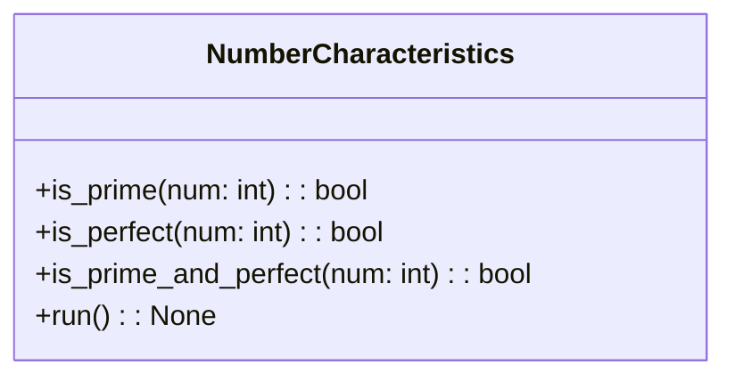

# US [Automated Workflow Management in AI Projects](./backlog_mlops_regresion.md) : Implement functionality to determine if a number is prime or perfect in a workflow context.

- [classes relations](#classes-relations)
- [**User Stories: Prime and Perfect Number Calculation**](#user-stories-prime-and-perfect-number-calculation)
  - [**1. User Story: Check if a Number is Prime**](#1-user-story-check-if-a-number-is-prime)
  - [**2. User Story: Check if a Number is Perfect**](#2-user-story-check-if-a-number-is-perfect)
  - [**3. User Story: Combine Prime and Perfect Verification**](#3-user-story-combine-prime-and-perfect-verification)
  - [**4. User Story: User Input Handling**](#4-user-story-user-input-handling)
  - [**5. User Story: Output Result to User**](#5-user-story-output-result-to-user)
  - [**Common Acceptance Criteria**](#common-acceptance-criteria)
  - [**Definition of Done (DoD):**](#definition-of-done-dod)
- [Code location](#code-location)
- [Test location](#test-location)

------------

## classes relations

## **User Stories: Prime and Perfect Number Calculation**

---

### **1. User Story: Check if a Number is Prime**

**Title:**  
As a **user**, I want to determine whether a given number is prime, so that I can understand its mathematical properties.

**Description:**  
The `is_prime` function assesses if a number is prime by testing its divisibility with integers up to its square root.

**Acceptance Criteria:**  
- The function returns `True` for prime numbers and `False` for non-prime numbers.
- The implementation handles edge cases (e.g., numbers less than 2).

---

### **2. User Story: Check if a Number is Perfect**

**Title:**  
As a **user**, I want to know if a number is perfect, so that I can identify numbers equal to the sum of their divisors.

**Description:**  
The `is_perfect` function calculates and verifies whether the sum of divisors of a number equals the number itself.

**Acceptance Criteria:**  
- The function returns `True` for perfect numbers and `False` for non-perfect numbers.
- Edge cases like numbers less than 1 are managed appropriately.

---

### **3. User Story: Combine Prime and Perfect Verification**

**Title:**  
As a **user**, I want to check if a number is both prime and perfect in a single function call, so that I can quickly assess its characteristics.

**Description:**  
The `is_prime_and_perfect` function combines both checks to provide a consolidated result.

**Acceptance Criteria:**  
- The function returns `True` only if the number is both prime and perfect.
- The logic correctly integrates the results from the prime and perfect checks.

---

### **4. User Story: User Input Handling**

**Title:**  
As a **user**, I want to input a number for evaluation through the command line, so that I can get instant feedback on its characteristics.

**Description:**  
The script uses standard input to receive a number from the user for evaluation.

**Acceptance Criteria:**  
- The program prompts the user for input and successfully processes it.
- Input validation ensures that non-integer values are appropriately handled.

---

### **5. User Story: Output Result to User**

**Title:**  
As a **user**, I want clear output messages indicating whether the number is prime, perfect, both, or neither, so that I can easily understand the result.

**Description:**  
Results from the evaluation functions should be conveyed in an easy-to-read format.

**Acceptance Criteria:**  
- The outcome of the evaluations is printed clearly, stating whether the number is prime, perfect, both, or neither.
- The output format is consistent and user-friendly.

---

### **Common Acceptance Criteria**

1. **Implementation Requirements:**
   - Each function must be clearly defined with proper input/output descriptions.
   - Functions should integrate smoothly with the command-line interface.

2. **Error Handling:**
   - Adequate error messages are displayed for invalid inputs.
   - Edge cases must be handled without causing the program to crash.

3. **Testing:**
   - Unit tests should verify each individual function for expected outputs with various inputs.
   - Edge cases and invalid inputs should also be included in the tests to ensure robustness.

4. **Documentation:**
   - Function docstrings must be complete, explaining parameters and return types.
   - Overall usage should be documented, including examples of expected inputs and outputs.

---

### **Definition of Done (DoD):** 

- All user stories related to checking prime and perfect numbers are implemented and functional.
- Each function is tested against expected results and edge cases.
- Documentation provides clear guidance for users on how to utilize the features.

## Code location

[src/model_name/number_characteristics.py](../src/model_name/number_characteristics.py)

## Test location

[tests/core/test_number_characteristics.py](../tests/core/test_number_characteristics.py)
