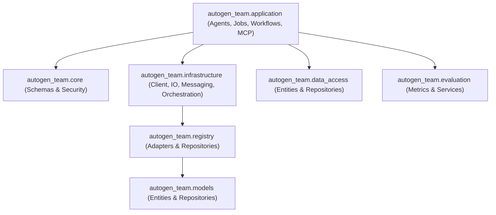
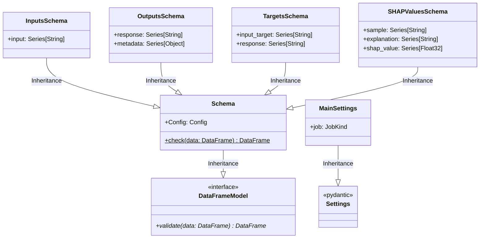

# ISO 42010 Component View: Subsystems & UML 2.0 Class Diagrams

## 1. Package Architecture Breakdown

---

## 2. UML 2.0 Class Diagram: Pandera Schemas & Pydantic Settings

---

## 3. Core Module Specifications

### 1. `autogen_team.core.schemas`
- **Source Line Citation**: `src/autogen_team/core/schemas.py:L18-L98`
- **Purpose**: Defines Pandera DataFrame models (`InputsSchema`, `OutputsSchema`, `TargetsSchema`, `SHAPValuesSchema`, `FeatureImportancesSchema`) enforcing runtime type checks and coercions (`coerce=True`, `strict=True`).

### 2. `autogen_team.settings`
- **Source Line Citation**: `src/autogen_team/settings.py:L13-L29`
- **Purpose**: Provides immutable Pydantic settings (`MainSettings`, `Settings`) configured with `strict=True`, `frozen=True`, and `extra="forbid"`.
