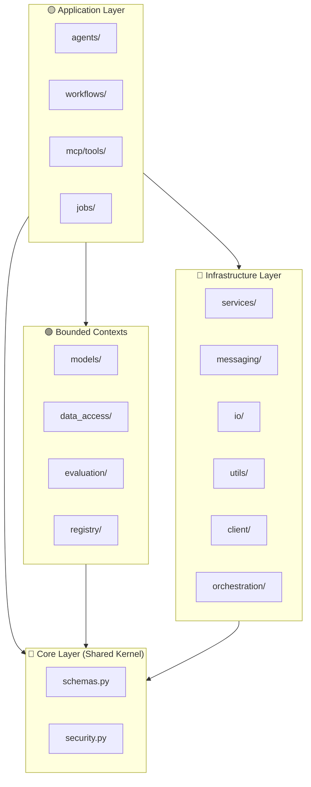

# Component & Structural View: Autogen Team

## 1. DDD Layer Architecture

The codebase enforces strict Domain-Driven Design with dependency inversion — inner layers never depend on outer layers.

## 2. Package-Level Component Diagram

```mermaid
classDiagram
    direction TB

    namespace CoreLayer {
        class Schema {
            <<abstract>>
            +check(data: DataFrame)* DataFrame
        }
        class safe_join {
            +safe_join(base: str, *paths: str) str
        }
    }

    namespace ApplicationLayer {
        class CoderAgent {
            -client: MCPClient
            +execute_task(task: Dict) Dict
        }
        class PlannerAgent {
            -client: MCPClient
            +create_plan(goal: str, repository_path: str) Dict
        }
        class ReviewerAgent {
            -client: MCPClient
            +review_changes(mission_id: str, file_changes: List) ReviewResult
        }
        class TesterAgent {
            -client: MCPClient
            +run_tests() Dict
        }
        class DocumentationAgent {
            -client: MCPClient
            +generate_docs(mission_id: str, mission_context: Dict) Dict
        }
        class Job {
            <<abstract>>
            #logger_service: LoggerService
            #alerts_service: AlertsService
            #mlflow_service: MlflowService
            +__enter__() Self
            +__exit__() bool
            +run()* Locals
        }
    }

    namespace InfrastructureLayer {
        class Service {
            <<abstract>>
            +start()* void
            +stop() void
        }
        class MCPClient {
            +connect() void
            +disconnect() void
            +call_tool(name: str, args: Dict) Dict
        }
        class FastAPIKafkaService {
            -producer: Producer
            -consumer: Consumer
            +start() void
            +stop() void
            -_consume_messages() void
            -_process_message(msg) void
        }
    }

    namespace ModelsContext {
        class Model {
            <<abstract>>
            +get_params(deep: bool) Params
            +set_params(**params) Self
            +load_context(model_config: Dict)* void
            +fit(inputs, targets)* Self
            +predict(inputs)* Outputs
            +explain_model() FeatureImportances
            +explain_samples(inputs) SHAPValues
        }
        class BaselineAutogenModel {
            -_model_client: OpenAIChatClient
            +max_tokens: int
            +temperature: float
            +load_context(model_config: Dict) void
            +fit(inputs, targets) Self
            +predict(inputs) Outputs
        }
    }

    Model <|-- BaselineAutogenModel : Inheritance
    Service <|-- MCPService : Inheritance
    Service <|-- LoggerService : Inheritance
    Service <|-- HatchetService : Inheritance
    Service <|-- MlflowService : Inheritance
    CoderAgent --> MCPClient : uses
    PlannerAgent --> MCPClient : uses
    ReviewerAgent --> MCPClient : uses
    TesterAgent --> MCPClient : uses
    DocumentationAgent --> MCPClient : uses
    Job --> Service : depends on
```

## 3. Core Layer (`src/autogen_team/core/`)

The shared kernel provides business-independent schemas and security utilities.

| Module | Key Classes | Line Span | Purpose |
| :--- | :--- | :--- | :--- |
| `schemas.py` | `Schema`, `InputsSchema`, `OutputsSchema`, `TargetsSchema`, `SHAPValuesSchema`, `FeatureImportancesSchema` | L1-L114 | Pandera `DataFrameModel` hierarchy for type-safe data validation |
| `security.py` | `safe_join()` | L1-L27 | Path traversal prevention utility |

## 4. Application Layer (`src/autogen_team/application/`)

Orchestrates use-cases without knowing infrastructure details.

| Sub-package | Key Classes | Purpose |
| :--- | :--- | :--- |
| `agents/` | `CoderAgent`, `PlannerAgent`, `ReviewerAgent`, `TesterAgent`, `DocumentationAgent` | Autonomous agents delegating to MCP tools |
| `workflows/` | `AutonomousMissionWorkflow`, `DevelopTaskWorkflow` | Hatchet workflow DSL for mission orchestration |
| `mcp/tools/` | `plan_mission`, `execute_code`, `run_tests`, `security_review`, `retrieve_context`, `index_code`, `generate_mission_docs` | MCP Server tool implementations |
| `jobs/` | `TrainingJob`, `EvaluationsJob`, `InferenceJob`, `TuningJob`, `PromotionJob`, `ExplanationsJob`, `HatchetInferenceJob` | Legacy batch LLMOps/MLOps jobs |

## 5. Infrastructure Layer (`src/autogen_team/infrastructure/`)

The outermost layer connecting to the world.

| Sub-package | Key Classes | Purpose |
| :--- | :--- | :--- |
| `services/` | `Service`, `LoggerService`, `MCPService`, `MlflowService`, `HatchetService`, `AlertsService`, `SandboxService` | Global service abstractions |
| `messaging/` | `FastAPIKafkaService`, A2A Protocol models | Kafka prediction & agent messaging |
| `io/` | `configs` (OmegaConf), `Env` (Pydantic Settings) | Configuration parsing & environment variables |
| `utils/` | `Searcher`, `Signer`, `Splitter` hierarchies | Hyperparameter search, model signing, data splitting |
| `client/` | `MCPClient` | MCP Server stdio client |
| `orchestration/` | `inference_workflow` | Hatchet inference workflow registration |

## 6. Bounded Contexts

Each bounded context operates with dedicated entities, repositories, and adapters:

| Context | Location | Entities | Adapters/Repositories |
| :--- | :--- | :--- | :--- |
| **Models** | `models/` | `Model`, `BaselineAutogenModel` | `ModelRepository` |
| **Data Access** | `data_access/` | `DatasetDescriptor` | `Reader`/`Writer`, `ParquetReader`/`ParquetWriter`, `DatasetRepository` |
| **Evaluation** | `evaluation/` | `MetricResult` | `Metric`, `AutogenMetric`, `AutogenConversationMetric`, `Threshold` |
| **Registry** | `registry/` | `Info`, `Version`, `Alias` | `Saver`/`CustomSaver`, `Loader`/`CustomLoader`, `Register`/`MlflowRegister` |
