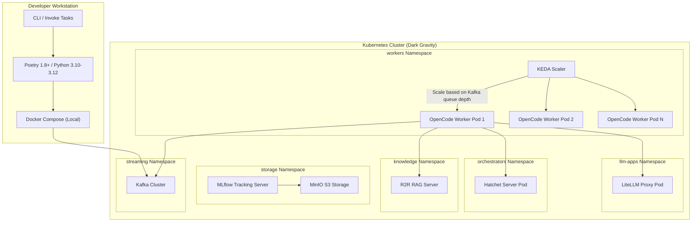

# Deployment View: Autogen Team

## 1. Deployment Topology



## 2. Container Specifications

### Dockerfile (`Dockerfile:L1-L14`)

```dockerfile
FROM python:3.10-slim
WORKDIR /app
COPY pyproject.toml poetry.lock ./
RUN pip install poetry && poetry install --no-dev
COPY src/ src/
COPY confs/ confs/
CMD ["poetry", "run", "autogen_team"]
```

### Docker Compose (`docker-compose.yml:L1-L8`)

Local development stack including Kafka, MLflow, and the inference service on port 8081.

## 3. Kubernetes Resources

| Resource | Location | Purpose |
| :--- | :--- | :--- |
| OpenCode Deployment | `k8s/base/opencode-deployment.yaml` | Main worker pod running Hatchet workflows |
| KEDA ScaledObject | Cluster-level | Scales OpenCode workers based on Kafka consumer lag |
| Service Account | Cluster-level | RBAC for MinIO and Hatchet API access |

## 4. Configuration Management

### Environment Variables (`src/autogen_team/infrastructure/io/osvariables.py:L15-L53`)

All runtime configuration is managed via the `Env` Pydantic Settings singleton with `.env` file support:

| Category | Variables | Default |
| :--- | :--- | :--- |
| **MLflow** | `MLFLOW_TRACKING_URI`, `MLFLOW_REGISTRY_URI`, `MLFLOW_EXPERIMENT_NAME`, `MLFLOW_REGISTERED_MODEL_NAME` | `./mlruns` |
| **S3/MinIO** | `AWS_ACCESS_KEY_ID`, `AWS_SECRET_ACCESS_KEY`, `MLFLOW_S3_ENDPOINT_URL` | Empty |
| **Hatchet** | `HATCHET_CLIENT_TOKEN`, `HATCHET_NAMESPACE`, `HATCHET_CLIENT_HOST_PORT`, `HATCHET_CLIENT_SERVER_URL` | Cluster internal URLs |
| **LiteLLM** | `LITELLM_API_BASE`, `LITELLM_API_KEY`, `LITELLM_MODEL` | `minimax-m2.7:cloud` |
| **R2R** | `R2R_BASE_URL` | `http://r2r.knowledge.svc.cluster.local:7272` |
| **MCP** | `MCP_HOST`, `MCP_PORT`, `MCP_PROMPTS_PATH` | `127.0.0.1:8200` |
| **Kafka** | `DEFAULT_KAFKA_SERVER`, `DEFAULT_GROUP_ID`, `DEFAULT_INPUT_TOPIC`, `DEFAULT_OUTPUT_TOPIC` | Cluster Kafka URL |

### OmegaConf YAML Configs (`confs/`)

Job-specific configurations parsed via `configs.parse_file()` → `OmegaConf.load()`:
- `confs/training.yaml` — Training job parameters
- `confs/evaluations.yaml` — Evaluation metrics and thresholds
- `confs/mcp_prompts.yaml` — System prompts for MCP tool agents

## 5. CI/CD Pipelines

### GitHub Actions (`.github/workflows/`)

| Workflow | Trigger | Purpose |
| :--- | :--- | :--- |
| `check.yml` | Push / PR | Lint (Ruff), Type check (Mypy), Tests (Pytest), Security (Bandit) |
| `publish.yml` | Release tag | Build and publish package |

### Development Workflow (Invoke Tasks)

```bash
inv format          # Ruff auto-format
inv checks          # Mypy + Pytest + Ruff lint
inv all             # E2E lifecycle test (Kafka, MCP boot)
inv --list          # List all available tasks
```

## 6. Build & Package

| Tool | Config File | Purpose |
| :--- | :--- | :--- |
| **Poetry** | `pyproject.toml:L22-L23` | Package management, dependency resolution |
| **Ruff** | `pyproject.toml:L128-L141` | Linting & formatting (line-length: 100, target: py312) |
| **Mypy** | `pyproject.toml:L114-L121` | Static type checking (strict mode) |
| **Pytest** | `pyproject.toml:L123-L126` | Test framework (pythonpath: `src`) |
| **Pre-commit** | `.pre-commit-config.yaml` | Git hooks for lint/format on commit |
