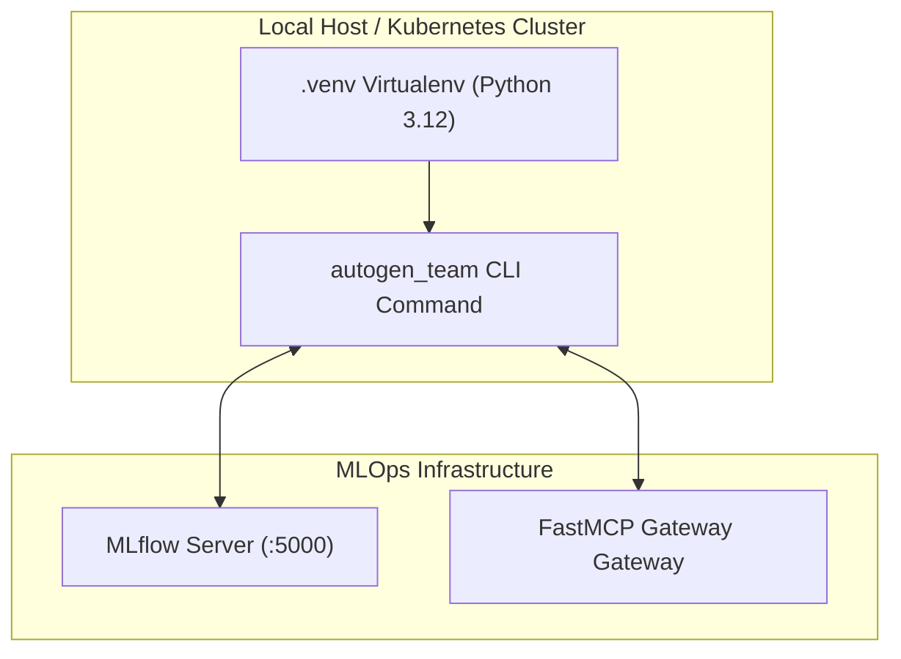

# ISO 42010 Deployment View: Package Topologies & Containerization

## 1. Poetry Packaging & Environment Topology

The `llmops-python-package` is managed via **Poetry** (`pyproject.toml`):

---

## 2. Docker & Multi-Stage Deployment

- **`Dockerfile`**: Builds lightweight production wheels (`poetry build`) and installs runtime dependencies.
- **`docker-compose.yml`**: Provisions local development infrastructure (MLflow server, FastMCP gateway, local storage volumes).
