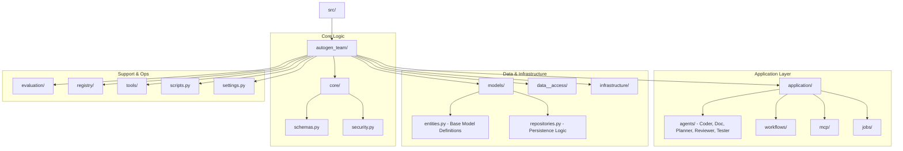
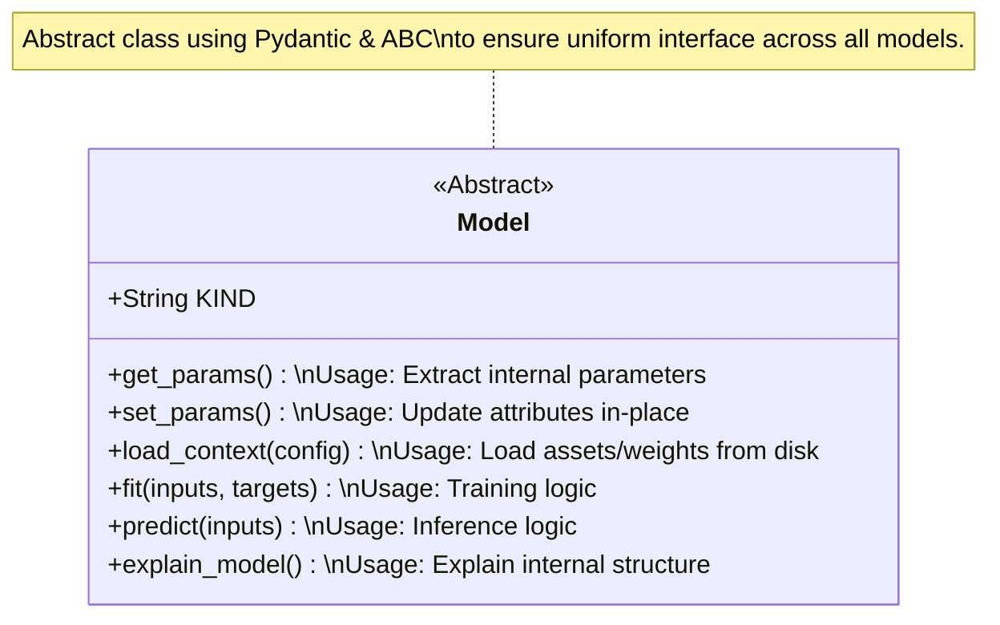

# Architecture Overview: `src` Directory

This document provides a comprehensive overview of the codebase structure within the `src/` directory, focusing on the `autogen_team` package.

## 1. System Structure (File Hierarchy)
The following diagram represents the physical layout of the source code. Each folder reflects a specific layer or domain in the application's architecture.

## 2. Model Inheritance (Core Entities)
The system uses a strict inheritance pattern for ML models to ensure consistency when swapping backend providers or model types. The base `Model` class defines the required interface.

## 3. Module Deep Dive

### `autogen_team/core/`
Contains the foundational logic used across the entire system.
- **schemas.py**: Defines common data shapes (Inputs, Outputs, etc.).
- **security.py**: Handles authentication and authorization helpers.

### `autogen_team/models/`
Defines the "objects" of the system.
- **entities.py**: Contains the `Model` base class. All specific implementations (e.g., GPT models, Llama models) must inherit from this to ensure compatibility with the `application/` layer.
- **repositories.py**: Defines the abstraction for how models are saved and loaded from storage.

### `autogen_team/application/`
The heart of the system where logic flows into actions.
- **agents/**: Individual agents (Coder, Planner, etc.) that perform specific roles.
- **workflows/**: Orchestration of multiple agent actions.
- **mcp/**: Integration with Model Context Protocol.

### `autogen_team/infrastructure/` & `data_access/`
Handles the "outside world".
- **infrastructure**: Low-level API clients, database drivers, and integration logic.
- **data_access**: High-level data retrieval methods used by the application layer.

## 4. Integration Points
To move from a script to a production agent system:
1.  New features should start in `core/` if they involve new data structures.
2.  New capabilities are implemented as `agents/`.
3.  Persistent storage is handled via the Repository pattern in `models/`.

---
*Last Updated: $(date)*
