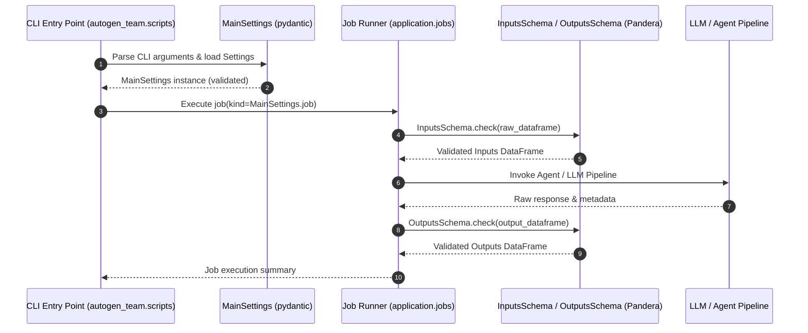

# ISO 42010 Sequence View: Execution Flows & Interaction Diagrams

## 1. Job Execution & Schema Validation Flow

---

## 2. Source Line References

- **Pandera Schema Validation Check**: `src/autogen_team/core/schemas.py:L36-L46`
- **MainSettings Parameter Coercion**: `src/autogen_team/settings.py:L21-L29`
- **CLI Script Execution**: `src/autogen_team/scripts.py:L1-L80`
