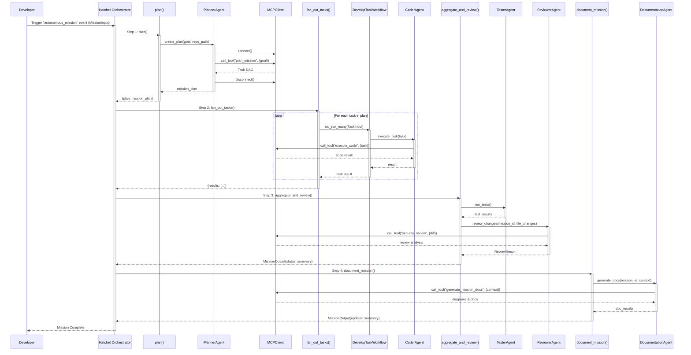
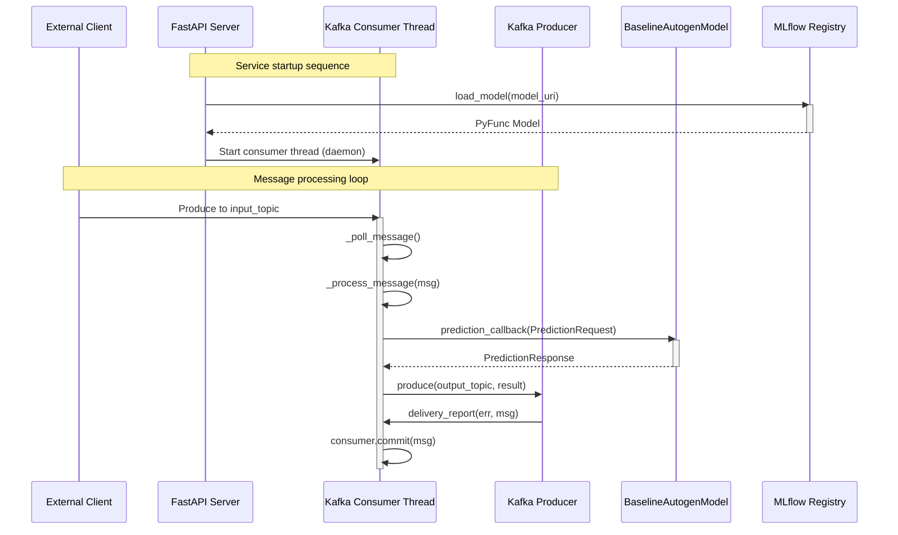
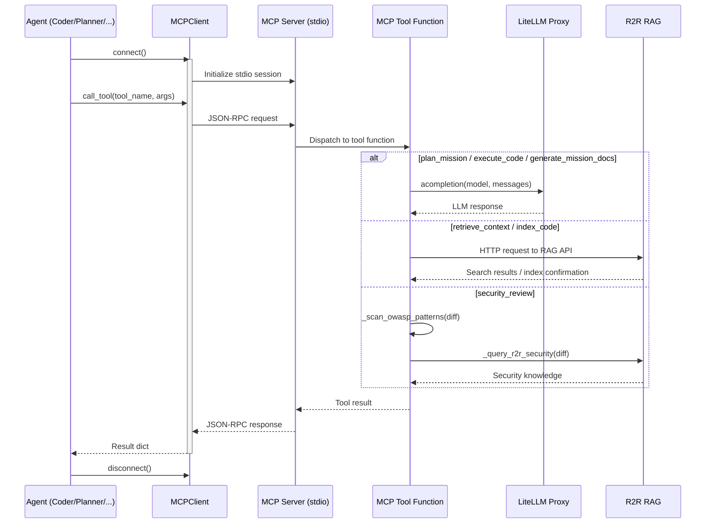
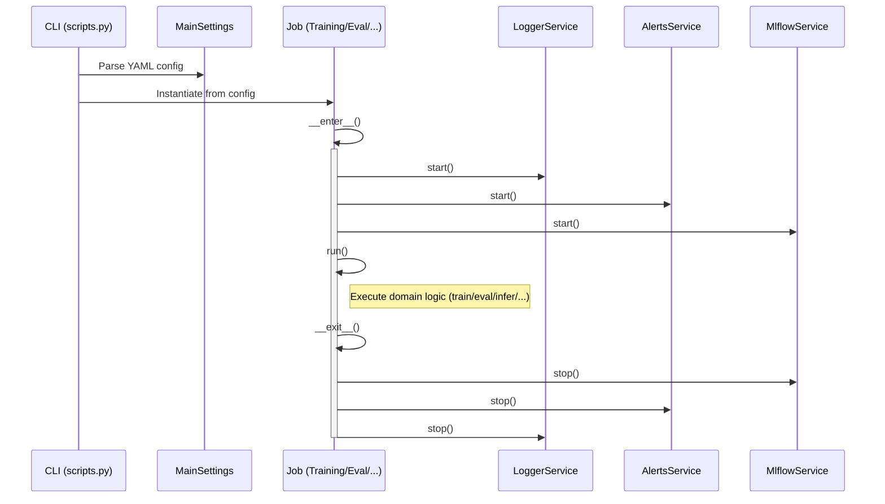

# Runtime Sequence View: Autogen Team

## 1. Autonomous Mission Lifecycle

The flagship workflow orchestrates Plan → Fan-Out → Review → Document using Hatchet's durable execution model (`src/autogen_team/application/workflows/autonomous_mission.py:L1-L214`).

## 2. Kafka Real-Time Prediction Flow

The `FastAPIKafkaService` (`src/autogen_team/infrastructure/messaging/kafka_app.py:L86-L234`) provides a dual-interface prediction service.

## 3. MCP Tool Invocation Pattern

All agents follow a consistent connect → call_tool → disconnect pattern via `MCPClient` (`src/autogen_team/infrastructure/client/mcp_client.py`).

## 4. Legacy Batch Job Execution

All batch jobs use a context-manager pattern with automatic service lifecycle management (`src/autogen_team/application/jobs/base.py:L21-L86`).

