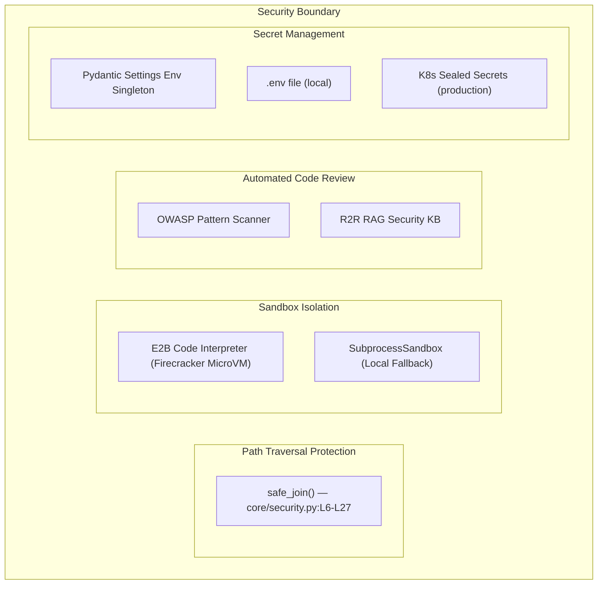
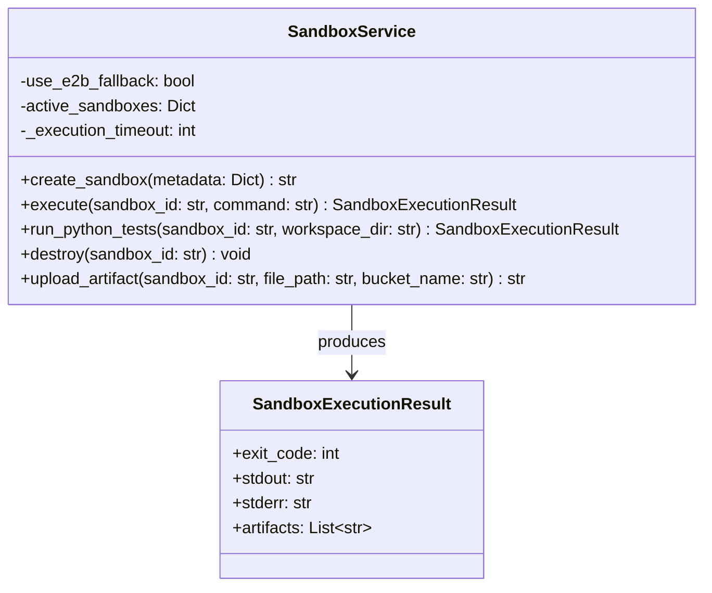
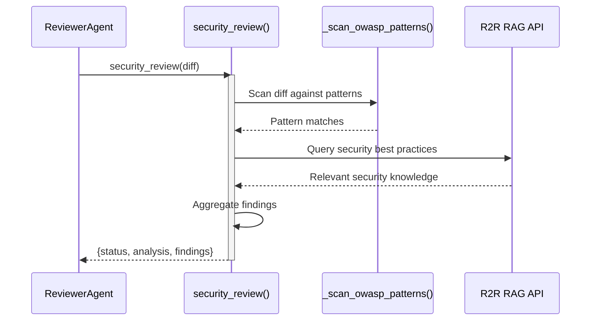

# Security View: Autogen Team

## 1. Security Architecture Overview



## 2. Path Traversal Protection

**Module:** `src/autogen_team/core/security.py:L6-L27`

The `safe_join()` function prevents path traversal attacks by resolving symlinks and validating the final path stays within the base directory:

```python
def safe_join(base: str, *paths: str) -> str:
    base_dir = os.path.realpath(base)
    final_path = os.path.realpath(os.path.join(base_dir, *paths))
    if os.path.commonpath([base_dir, final_path]) != base_dir:
        raise ValueError(f"Path traversal detected: {final_path} is not within {base_dir}")
    return final_path
```

**Usage Points:**
- `infrastructure/services/sandbox_service.py:L162-L168` — Validates artifact upload paths
- `application/mcp/tools/run_tests.py` — Validates workspace directories for test execution

## 3. Sandbox Isolation

**Module:** `src/autogen_team/infrastructure/services/sandbox_service.py:L39-L189`



| Security Feature | Implementation | Location |
| :--- | :--- | :--- |
| **MicroVM Isolation** | E2B Code Interpreter (Firecracker-based) | `sandbox_service.py:L62-L71` |
| **Execution Timeout** | Configurable via `SANDBOX_TIMEOUT_SECONDS` (default: 300s) | `sandbox_service.py:L45` |
| **Artifact Path Validation** | `safe_join()` before S3 upload | `sandbox_service.py:L161-L168` |
| **Command Sanitization** | `shlex.quote()` for workspace directories | `sandbox_service.py:L126` |
| **Resource Cleanup** | Automatic sandbox destruction via `destroy()` | `sandbox_service.py:L129-L142` |

## 4. OWASP & Security Review

**Module:** `src/autogen_team/application/mcp/tools/security_review.py`

The `security_review` MCP tool performs automated security analysis on code diffs:

1. **OWASP Pattern Scanning** (`_scan_owasp_patterns`): Regex-based detection of common vulnerability patterns.
2. **RAG Security Knowledge** (`_query_r2r_security`): Queries R2R knowledge graph for security best practices relevant to the diff context.



## 5. Secret Management

| Layer | Mechanism | Scope |
| :--- | :--- | :--- |
| **Local Development** | `.env` file + `Env` Pydantic Settings | `infrastructure/io/osvariables.py:L47-L52` |
| **Production (K8s)** | Kubernetes Sealed Secrets → env vars | GitOps deployment manifests |
| **API Keys** | `LITELLM_API_KEY`, `HATCHET_CLIENT_TOKEN`, `AWS_*` | Never hardcoded in source |
| **MLflow Config** | Environment-variable expansion in model configs | `models/entities.py:L200-L208` (`expand_env()`) |

### Environment Variable Expansion

The `BaselineAutogenModel.load_context()` method supports `${VAR_NAME}` syntax for resolving secrets at runtime:

```python
def expand_env(value: Any) -> Any:
    if isinstance(value, str) and value.startswith("${") and value.endswith("}"):
        env_var = value[2:-1]
        return os.getenv(env_var, value)
    return value
```

## 6. Known Security Considerations

Based on the security sentinel log (`wiki/sentinel.md`):

| Date | Issue | Status |
| :--- | :--- | :--- |
| 2024-05-15 | Path Traversal in MCP Tools | Fixed (`safe_join`) |
| 2024-10-24 | Insecure Default Bind Address in MCP Server | Mitigated (configurable via `MCP_HOST`) |
| 2026-02-03 | Hardcoded Secrets in MLflow Adapters | Fixed (env var expansion) |
| 2026-02-04 | Information Exposure in Kafka Service | Fixed (error message sanitization) |
| 2026-02-05 | Path Traversal in MCP Tools (additional) | Fixed (`safe_join` hardening) |
