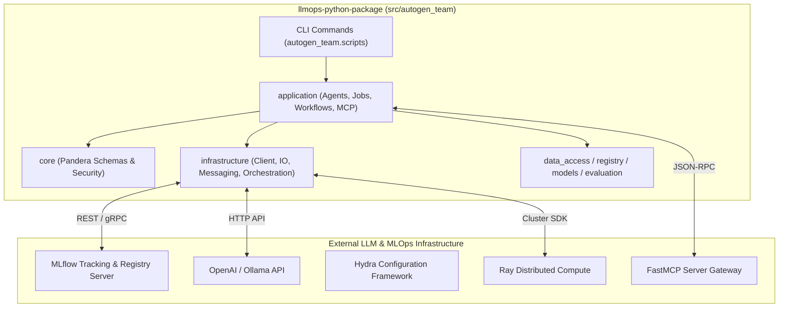

# ISO 42010 Context View: System Boundaries & External Interfaces

## 1. System Boundary Diagram

---

## 2. External Interface Specification

| External System | Protocol / Format | Interface Purpose | Implementation Citation |
| :--- | :--- | :--- | :--- |
| **MLflow Tracking Server** | REST API / Python SDK | Logs model metrics, artifacts, and registers LLM versions | `src/autogen_team/registry/` |
| **FastMCP Gateway** | JSON-RPC 2.0 over stdio/HTTP | Exposes autogen tools and workflows as MCP server capabilities | `src/autogen_team/application/mcp/` |
| **Pandera Validation Engine** | Python DataFrame Typing | Enforces column schemas (`InputsSchema`, `OutputsSchema`, `TargetsSchema`) | `src/autogen_team/core/schemas.py:L18-L98` |
| **Pydantic Settings** | Environment Variables / YAML | Validates application job configurations (`MainSettings`) | `src/autogen_team/settings.py:L13-L29` |
