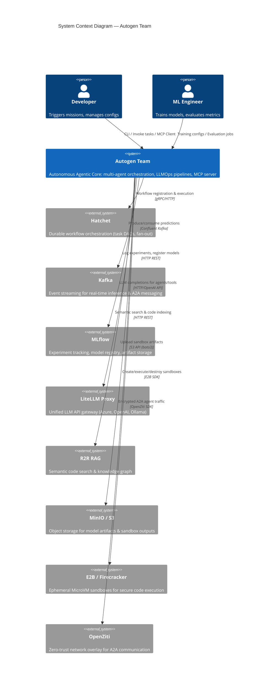
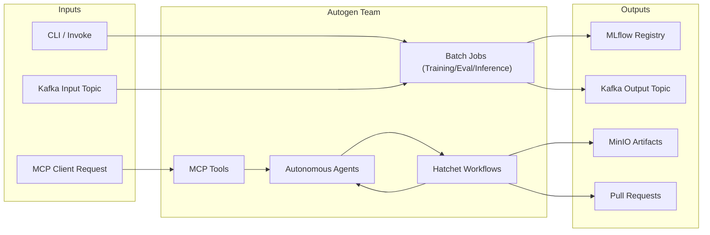

# System Context View: Autogen Team

## 1. System Boundary

The `autogen_team` package operates as the **intelligence core** within the Dark Gravity CA/CD Autonomous Agent Factory cluster. It consumes and produces interactions with multiple external systems via well-defined integration points.

## 2. Context Diagram

## 3. External System Integration Details

| External System | Integration Module | Protocol | Configuration Source |
| :--- | :--- | :--- | :--- |
| **Hatchet** | `infrastructure/services/hatchet_service.py:L15-L86` | gRPC/HTTP | `Env.hatchet_client_*` |
| **Kafka** | `infrastructure/messaging/kafka_app.py:L86-L234` | Confluent Kafka | `DEFAULT_KAFKA_SERVER` env var |
| **MLflow** | `infrastructure/services/mlflow_service.py`, `registry/adapters/mlflow_adapter.py:L1-L341` | HTTP REST | `Env.mlflow_*` |
| **LiteLLM** | `infrastructure/services/mcp_service.py:L17-L84` | OpenAI-compatible API | `Env.litellm_*` |
| **R2R RAG** | `infrastructure/services/mcp_service.py:L44-L47` | HTTP REST | `Env.r2r_base_url` |
| **MinIO / S3** | `infrastructure/services/sandbox_service.py:L144-L189` | S3 API (boto3) | `MLFLOW_S3_ENDPOINT_URL`, `AWS_*` |
| **E2B** | `infrastructure/services/sandbox_service.py:L39-L143` | E2B SDK | `E2B_AVAILABLE` feature flag |
| **OpenZiti** | A2A Protocol schemas (`infrastructure/messaging/a2a_protocol.py:L1-L45`) | OpenZiti SDK | Cluster-level config |

## 4. Data Flow Summary

