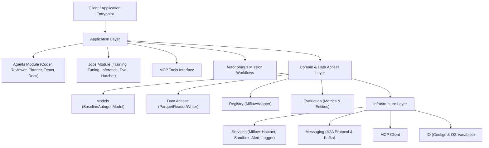

# OpenWiki Architecture Documentation

Welcome to the **OpenWiki Architecture Documentation** for the `llmops-python-package` repository. This wiki provides enterprise-grade, AST-grounded documentation adhering to the Open Knowledge Format (OKF) and OpenWiki standards.

All diagrams and class relations are deterministically derived from local AST analysis using Pyreverse and Graphify tools.

---

## 🚀 Getting Started

* **Quickstart Guide:** [quickstart.md](quickstart.md)
* **System Logs & Changelog:** [logs.md](logs.md)

---

## 🏛 System Architecture & Component Map

---

## 📂 Documentation Directory Structure

The documentation structure strictly mirrors the layout of the `src/autogen_team` source codebase:

### 1. Root & Core Package
* **Package Overview:** [src/autogen_team/index.md](src/autogen_team/index.md)
* **Core Schemas & Security:** [src/autogen_team/core.md](src/autogen_team/core.md)
* **Settings & Scripts:** [src/autogen_team/settings_and_scripts.md](src/autogen_team/settings_and_scripts.md)

### 2. Application Layer
* **Agents:** [src/autogen_team/application/agents.md](src/autogen_team/application/agents.md)
* **Jobs Execution Framework:** [src/autogen_team/application/jobs.md](src/autogen_team/application/jobs.md)
* **Model Context Protocol (MCP) Tools:** [src/autogen_team/application/mcp.md](src/autogen_team/application/mcp.md)
* **Workflows:** [src/autogen_team/application/workflows.md](src/autogen_team/application/workflows.md)

### 3. Domain & Data Access
* **Data Access Adapters & Repositories:** [src/autogen_team/data_access.md](src/autogen_team/data_access.md)
* **Machine Learning Models:** [src/autogen_team/models.md](src/autogen_team/models.md)
* **Model & Data Registry:** [src/autogen_team/registry.md](src/autogen_team/registry.md)
* **Evaluation Framework:** [src/autogen_team/evaluation.md](src/autogen_team/evaluation.md)

### 4. Infrastructure Layer
* **MCP Infrastructure Client:** [src/autogen_team/infrastructure/client.md](src/autogen_team/infrastructure/client.md)
* **IO & Configurations:** [src/autogen_team/infrastructure/io.md](src/autogen_team/infrastructure/io.md)
* **Messaging & Agent-to-Agent Protocols:** [src/autogen_team/infrastructure/messaging.md](src/autogen_team/infrastructure/messaging.md)
* **Orchestration Workflows (Hatchet):** [src/autogen_team/infrastructure/orchestration.md](src/autogen_team/infrastructure/orchestration.md)
* **Services (MLflow, Hatchet, Sandbox, Alert, Logger):** [src/autogen_team/infrastructure/services.md](src/autogen_team/infrastructure/services.md)
* **Utilities (Searchers, Signers, Splitters):** [src/autogen_team/infrastructure/utils.md](src/autogen_team/infrastructure/utils.md)

---

## 📌 Standard Compliance
* **OKF Standard:** Open Knowledge Format with standardized YAML frontmatter metadata.
* **Paths:** Strictly relative to the repository root. Absolute paths are banned.
* **UML 2.0 Mermaid:** Validated class and sequence diagrams based on Pyreverse AST parsing.
