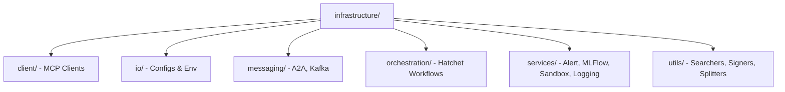

# Infrastructure Layer Documentation

The `infrastructure` layer manages the low-level integrations, external clients, and utility services that power the application logic. It abstracts away the complexities of different protocols, messaging systems, and service providers.

## Overview of Sub-modules

### 1. client/
Handles direct connections to external interfaces and protocols.
- **mcp_client.py**: Implements the Model Context Protocol (MCP) client to interact with standardized tools and resources.

### 2. io/
Manages input/output operations, environment configurations, and filesystem interactions.
- **configs.py**: Handles loading and validation of configuration files.
- **osvariables.py**: Manages system environment variables and local environment overrides.

### 3. messaging/
Handles asynchronous communication and internal data streaming.
- **a2a_protocol.py**: Defines the "Agent to Agent" (A2A) protocol for consistent communication between different roles in a team.
- **kafka_app.py**: Integrates with Apache Kafka for high-throughput message processing and distribution.

### 4. orchestration/
Handles workflow management and stateful execution of tasks.
- **hatchet_workflows.py**: Interfaces with Hatchet to manage long-running processes, retries, and complex task graphs.

### 5. services/
Wraps complex business logic into usable internal services for the application layer.
- **alert_service.py**: Manages notifications and alerts.
- **hatchet_service.py**: Core integration service for Hatchet orchestration.
- **logger_service.py**: Custom logging implementation with context awareness.
- **mcp_service.py**: High-level service layer for MCP functionality.
- **mlflow_service.py**: Integration with MLFlow for tracking experiments and models.
- **sandbox_service.py**: Manages execution in isolated environments (e.g., Docker or restricted shells).

### 6. utils/
Provides helper functions that are reused across multiple modules.
- **searchers.py**: Tools for searching documents, web results, or local indices.
- **signers.py**: Logic for signing requests or messages for security.
- **splitters.py**: Utility methods for breaking down large text blocks into chunks (e.g., for context window management).

## Infrastructure Map

