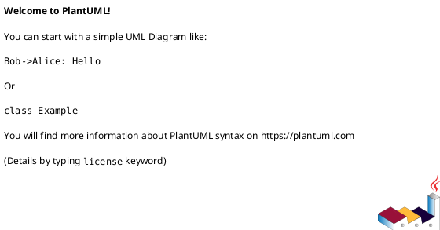
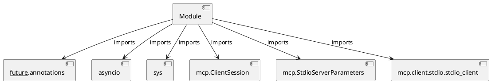

# Module Specification: check_mcp_health

* **Source Reference:** `Scripts/check_mcp_health.py`

## 1. Architectural Role & Responsibilities
**Purpose:**
Provides functionality related to check mcp health.

**Architecture Layer:**
- Infrastructure/Other

**Responsibilities:**
- Manage and execute operations for check_mcp_health.

**Main Workflow:**
- Initialize components and process requests for check_mcp_health.

## 2. Dependencies
**Imports:**
- `__future__.annotations`
- `asyncio`
- `sys`
- `mcp.ClientSession`
- `mcp.StdioServerParameters`
- `mcp.client.stdio.stdio_client`

**Exported Classes:**
- None

**Exported Functions:**
- `check_mcp_health`

## 3. Architecture & Execution
### Internal Architecture
Follows standard modular design, encapsulating state and behavior within defined classes and functions.

### Execution Flow
Sequential execution of defined functions and class methods.

### Sequence Explanation
Clients instantiate classes or call functions, which execute business logic and return results.

## 4. UML 2.0 Diagrams
### Class Diagram

### Dependency Graph

## 5. Class & Method Specifications
## 6. Module Functions
### `check_mcp_health()`
Connect to MCP server and verify tool listing.

**Inputs:**
- None

**Output:**
- Return Type: `None`
