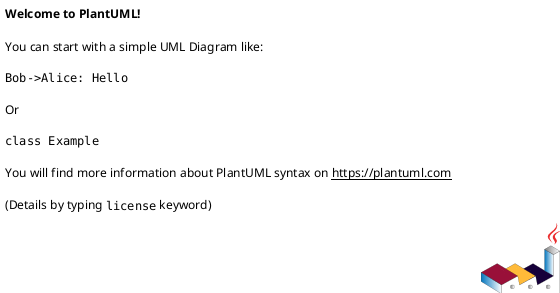
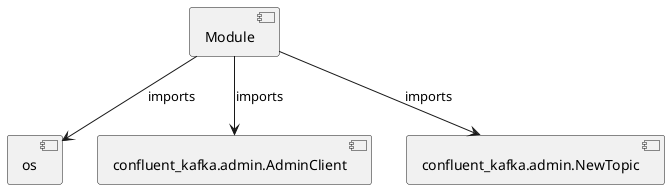

# Module Specification: create_topics

* **Source Reference:** `Scripts/create_topics.py`

## 1. Architectural Role & Responsibilities
**Purpose:**
Provides functionality related to create topics.

**Architecture Layer:**
- Infrastructure/Other

**Responsibilities:**
- Not explicitly defined.

**Main Workflow:**
- Not explicitly defined.

## 2. Dependencies
**Imports:**
- `os`
- `confluent_kafka.admin.AdminClient`
- `confluent_kafka.admin.NewTopic`

**Exported Classes:**
- None

**Exported Functions:**
- None

## 3. Architecture & Execution
### Internal Architecture
Not explicitly defined.

### Execution Flow
Not explicitly defined.

### Sequence Explanation
Not explicitly defined.

## 4. UML 2.0 Diagrams
### Class Diagram

### Dependency Graph

## 5. Class & Method Specifications
## 6. Module Functions