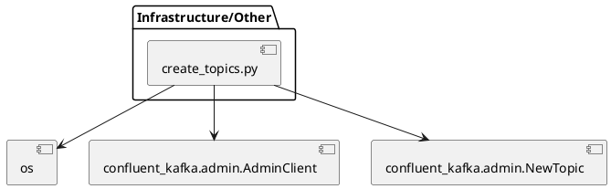
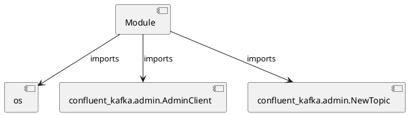
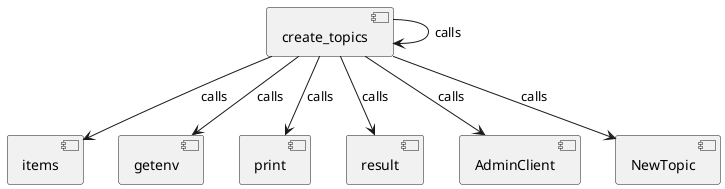

# Module Specification: create_topics

* **Source Reference:** `Scripts/create_topics.py`

## 1. Architectural Role & Responsibilities
**Purpose:**
Provides functionality related to create topics.

**Architecture Layer:**
- Infrastructure/Other

**Responsibilities:**
- Manages operations and logic for create topics.

**Main Workflow:**
- Executes the primary flow defined by create topics functions and classes.

## 2. Dependencies
**Imports:**
- `os`
- `confluent_kafka.admin.AdminClient`
- `confluent_kafka.admin.NewTopic`

**Exported Classes:**
- None

**Exported Functions:**
- None

**Exported Interfaces:**
- Not explicitly defined.

**Public API:**
- Not explicitly defined.

## 3. Architecture & Execution
### Internal Architecture
Not explicitly defined.

### Execution Flow
Not explicitly defined.

### Sequence Explanation
Not explicitly defined.

### Examples
Not explicitly defined.

## 4. UML 2.0 Diagrams
### Class Diagram

```plantuml
@startuml
    ' No classes found in module
@enduml
```

### Sequence Diagram

```plantuml
@startuml
    ' No functions for sequence
@enduml
```

### Component Diagram

```plantuml
@startuml
    package "Infrastructure/Other" {
        [create_topics.py]
    }
    [create_topics.py] --> [os]
    [create_topics.py] --> [confluent_kafka.admin.AdminClient]
    [create_topics.py] --> [confluent_kafka.admin.NewTopic]
@enduml
```

### Dependency Graph

```plantuml
@startuml
    [Module] --> [os] : imports
    [Module] --> [confluent_kafka.admin.AdminClient] : imports
    [Module] --> [confluent_kafka.admin.NewTopic] : imports
@enduml
```

## 5. Class & Method Specifications
## 6. Module Functions
## 7. Call Graph

```plantuml
@startuml
[create_topics] --> [items] : calls
[create_topics] --> [getenv] : calls
[create_topics] --> [print] : calls
[create_topics] --> [result] : calls
[create_topics] --> [AdminClient] : calls
[create_topics] --> [NewTopic] : calls
[create_topics] --> [create_topics] : calls
@enduml
```

## 8. Cross References
- **Parent module:** None
- **Child modules:** None
- **Dependencies:** `confluent_kafka.admin.AdminClient`, `os`, `confluent_kafka.admin.NewTopic`
- **Used by:** None
- **Calls:** items, getenv, print, result, AdminClient, NewTopic, create_topics
- **Called from:** None
- **Related classes:** [Classes](../../classes/index.md)
- **Related interfaces:** Not explicitly defined.
- **Related diagrams:** [Diagrams](../../diagrams/index.md)
