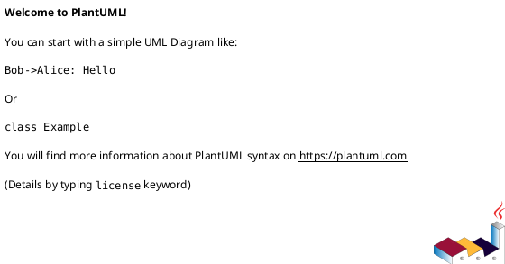
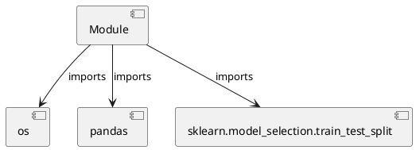

# Module Specification: prepare_data

* **Source Reference:** `Scripts/prepare_data.py`

## 1. Architectural Role & Responsibilities
**Purpose:**
Provides functionality related to prepare data.

**Architecture Layer:**
- Repositories

**Responsibilities:**
- Not explicitly defined.

**Main Workflow:**
- Not explicitly defined.

## 2. Dependencies
**Imports:**
- `os`
- `pandas`
- `sklearn.model_selection.train_test_split`

**Exported Classes:**
- None

**Exported Functions:**
- None

## 3. Architecture & Execution
### Internal Architecture
Not explicitly defined.

### Execution Flow
Not explicitly defined.

### Sequence Explanation
Not explicitly defined.

## 4. UML 2.0 Diagrams
### Class Diagram

### Dependency Graph

## 5. Class & Method Specifications
## 6. Module Functions