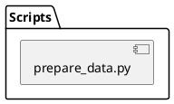
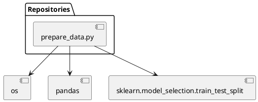
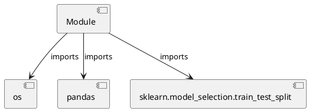
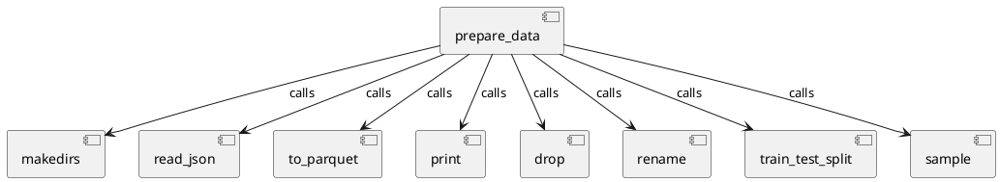

# Module Specification: prepare_data

* **Source Reference:** `Scripts/prepare_data.py`

## 1. Architectural Role & Responsibilities
**Purpose:**
Provides functionality related to prepare data.

**Architecture Layer:**
- Repositories

**Responsibilities:**
- Not explicitly defined.

**Main Workflow:**
- Not explicitly defined.

## 2. Dependencies
**Imports:**
- `os`
- `pandas`
- `sklearn.model_selection.train_test_split`

**Exported Classes:**
- None

**Exported Functions:**
- None

**Exported Interfaces:**
- Not explicitly defined.

**Public API:**
- Not explicitly defined.

## 3. Architecture & Execution
### Internal Architecture
Not explicitly defined.

### Execution Flow
Not explicitly defined.

### Sequence Explanation
Not explicitly defined.

### Examples
Not explicitly defined.

## 4. UML 2.0 Diagrams
### Class Diagram

```plantuml
@startuml
    ' No classes found in module
@enduml
```

### Package Diagram

```plantuml
@startuml
    package "Scripts" {
        [prepare_data.py]
    }
@enduml
```

### Sequence Diagram

```plantuml
@startuml
    ' No functions for sequence
@enduml
```

### Component Diagram

```plantuml
@startuml
    package "Repositories" {
        [prepare_data.py]
    }
    [prepare_data.py] --> [os]
    [prepare_data.py] --> [pandas]
    [prepare_data.py] --> [sklearn.model_selection.train_test_split]
@enduml
```

### Dependency Graph

```plantuml
@startuml
    [Module] --> [os] : imports
    [Module] --> [pandas] : imports
    [Module] --> [sklearn.model_selection.train_test_split] : imports
@enduml
```

## 5. Class & Method Specifications
## 6. Module Functions
## 7. Call Graph

```plantuml
@startuml
[prepare_data] --> [makedirs] : calls
[prepare_data] --> [read_json] : calls
[prepare_data] --> [to_parquet] : calls
[prepare_data] --> [print] : calls
[prepare_data] --> [drop] : calls
[prepare_data] --> [rename] : calls
[prepare_data] --> [train_test_split] : calls
[prepare_data] --> [sample] : calls
@enduml
```

## 8. Cross References
- **Dependencies:** [Dependencies](../../dependencies/index.md)
- **Used by:** None
- **Calls:** makedirs, read_json, to_parquet, print, drop, rename, train_test_split, sample
- **Called from:** None
- **Related classes:** [Classes](../../classes/index.md)
- **Related diagrams:** [Diagrams](../../diagrams/index.md)
