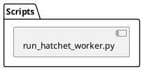
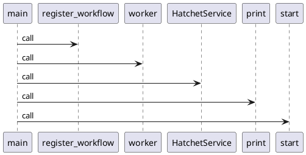
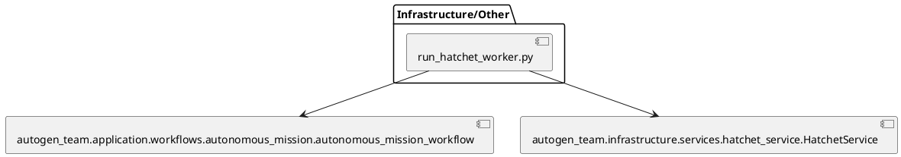
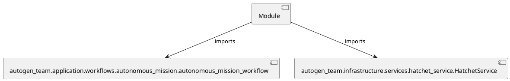
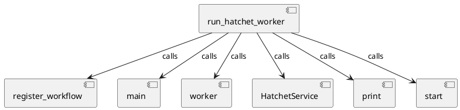

# Module Specification: run_hatchet_worker

* **Source Reference:** `Scripts/run_hatchet_worker.py`

## 1. Architectural Role & Responsibilities
**Purpose:**
Provides functionality related to run hatchet worker.

**Architecture Layer:**
- Infrastructure/Other

**Responsibilities:**
- Not explicitly defined.

**Main Workflow:**
- Not explicitly defined.

## 2. Dependencies
**Imports:**
- `autogen_team.application.workflows.autonomous_mission.autonomous_mission_workflow`
- `autogen_team.infrastructure.services.hatchet_service.HatchetService`

**Exported Classes:**
- None

**Exported Functions:**
- `main`

**Exported Interfaces:**
- Not explicitly defined.

**Public API:**
- Not explicitly defined.

## 3. Architecture & Execution
### Internal Architecture
Not explicitly defined.

### Execution Flow
Not explicitly defined.

### Sequence Explanation
Not explicitly defined.

### Examples
Not explicitly defined.

## 4. UML 2.0 Diagrams
### Class Diagram

```plantuml
@startuml
    ' No classes found in module
@enduml
```

### Package Diagram

```plantuml
@startuml
    package "Scripts" {
        [run_hatchet_worker.py]
    }
@enduml
```

### Sequence Diagram

```plantuml
@startuml
    main -> register_workflow : call
    main -> worker : call
    main -> HatchetService : call
    main -> print : call
    main -> start : call
@enduml
```

### Component Diagram

```plantuml
@startuml
    package "Infrastructure/Other" {
        [run_hatchet_worker.py]
    }
    [run_hatchet_worker.py] --> [autogen_team.application.workflows.autonomous_mission.autonomous_mission_workflow]
    [run_hatchet_worker.py] --> [autogen_team.infrastructure.services.hatchet_service.HatchetService]
@enduml
```

### Dependency Graph

```plantuml
@startuml
    [Module] --> [autogen_team.application.workflows.autonomous_mission.autonomous_mission_workflow] : imports
    [Module] --> [autogen_team.infrastructure.services.hatchet_service.HatchetService] : imports
@enduml
```

## 5. Class & Method Specifications
## 6. Module Functions
### `main() -> None` (Public)
**Description:** No description provided.

**Inputs:**
- None

**Output:**
- return type: `None`
- semantic meaning: Not explicitly defined.
- possible null values: Not explicitly defined.
- exceptions: Not explicitly defined.

**Side Effects:**
- Database updates: Not explicitly defined.
- File operations: Not explicitly defined.
- Network calls: Not explicitly defined.
- Cache: Not explicitly defined.
- State changes: Not explicitly defined.

**Complexity:**
- Time Complexity: Not explicitly defined.
- Space Complexity: Not explicitly defined.

**Example:**
```python
result = main()
```

## 7. Call Graph

```plantuml
@startuml
[run_hatchet_worker] --> [register_workflow] : calls
[run_hatchet_worker] --> [main] : calls
[run_hatchet_worker] --> [worker] : calls
[run_hatchet_worker] --> [HatchetService] : calls
[run_hatchet_worker] --> [print] : calls
[run_hatchet_worker] --> [start] : calls
@enduml
```

## 8. Cross References
- **Dependencies:** [Dependencies](../../dependencies/index.md)
- **Used by:** None
- **Calls:** register_workflow, main, worker, HatchetService, print, start
- **Called from:** trigger_mission.md, ../src/autogen_team/__main__.md, verify_agent_mcp.md, ../tests/test_scripts.md, ../tests/infrastructure/messaging/test_kafka_app.md, ../tests/evaluation/metrics/test_metrics.md, ../skills/validate/scripts/convert_links.md, test_mcp_client_simple.md, ../src/autogen_team/infrastructure/messaging/kafka_app.md, ../tests/registry/adapters/test_security_mlflow_adapter.md, ../skills/validate/scripts/okf_validate.md, ../tests/repro_kafka_log.md, send_kafka_test.md
- **Related classes:** [Classes](../../classes/index.md)
- **Related diagrams:** [Diagrams](../../diagrams/index.md)
