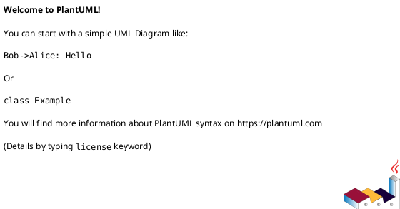
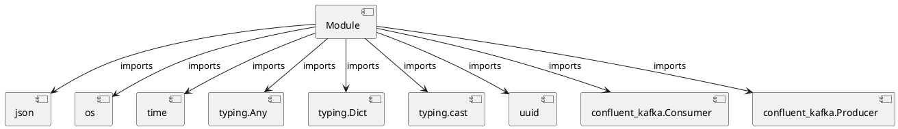

# Module Specification: send_kafka_test

* **Source Reference:** `Scripts/send_kafka_test.py`

## 1. Architectural Role & Responsibilities
**Purpose:**
Provides functionality related to send kafka test.

**Architecture Layer:**
- Infrastructure/Other

**Responsibilities:**
- Not explicitly defined.

**Main Workflow:**
- Not explicitly defined.

## 2. Dependencies
**Imports:**
- `json`
- `os`
- `time`
- `typing.Any`
- `typing.Dict`
- `typing.cast`
- `uuid`
- `confluent_kafka.Consumer`
- `confluent_kafka.Producer`

**Exported Classes:**
- None

**Exported Functions:**
- `delivery_report`
- `main`

## 3. Architecture & Execution
### Internal Architecture
Not explicitly defined.

### Execution Flow
Not explicitly defined.

### Sequence Explanation
Not explicitly defined.

## 4. UML 2.0 Diagrams
### Class Diagram

### Dependency Graph

## 5. Class & Method Specifications
## 6. Module Functions
### `delivery_report(err: Any, msg: Any)`
No description provided.

**Inputs:**
- `err`: Any
- `msg`: Any

**Output:**
- Return Type: `None`

### `main()`
No description provided.

**Inputs:**
- None

**Output:**
- Return Type: `None`
