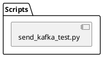
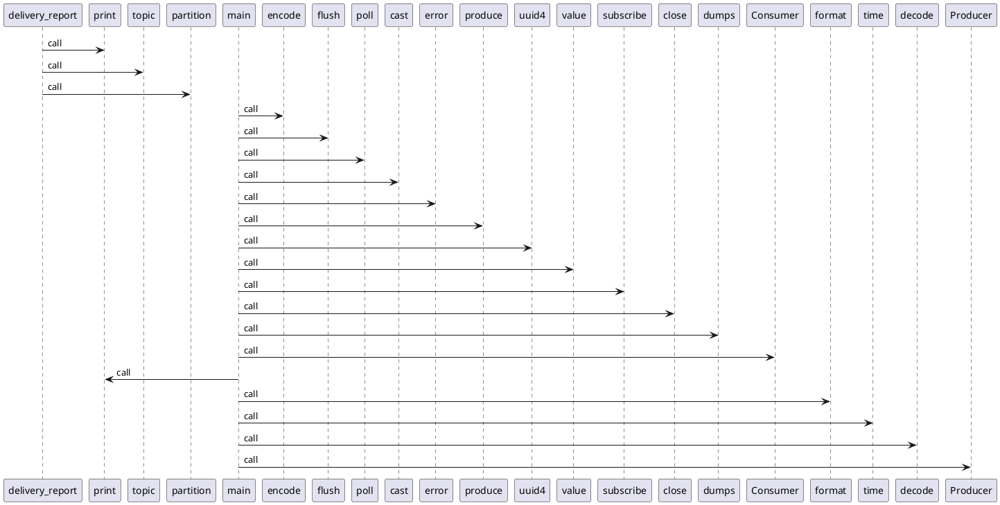
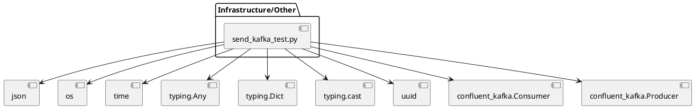
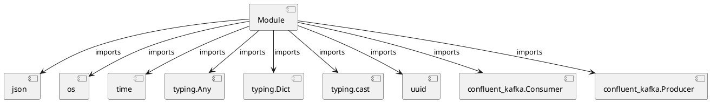

# Module Specification: send_kafka_test

* **Source Reference:** `Scripts/send_kafka_test.py`

## 1. Architectural Role & Responsibilities
**Purpose:**
Provides functionality related to send kafka test.

**Architecture Layer:**
- Infrastructure/Other

**Responsibilities:**
- Not explicitly defined.

**Main Workflow:**
- Not explicitly defined.

## 2. Dependencies
**Imports:**
- `json`
- `os`
- `time`
- `typing.Any`
- `typing.Dict`
- `typing.cast`
- `uuid`
- `confluent_kafka.Consumer`
- `confluent_kafka.Producer`

**Exported Classes:**
- None

**Exported Functions:**
- `delivery_report`
- `main`

**Exported Interfaces:**
- Not explicitly defined.

**Public API:**
- Not explicitly defined.

## 3. Architecture & Execution
### Internal Architecture
Not explicitly defined.

### Execution Flow
Not explicitly defined.

### Sequence Explanation
Not explicitly defined.

### Examples
Not explicitly defined.

## 4. UML 2.0 Diagrams
### Class Diagram

```plantuml
@startuml
    ' No classes found in module
@enduml
```

### Package Diagram

```plantuml
@startuml
    package "Scripts" {
        [send_kafka_test.py]
    }
@enduml
```

### Sequence Diagram

```plantuml
@startuml
    delivery_report -> print : call
    delivery_report -> topic : call
    delivery_report -> partition : call
    main -> encode : call
    main -> flush : call
    main -> poll : call
    main -> cast : call
    main -> error : call
    main -> produce : call
    main -> uuid4 : call
    main -> value : call
    main -> subscribe : call
    main -> close : call
    main -> dumps : call
    main -> Consumer : call
    main -> print : call
    main -> format : call
    main -> time : call
    main -> decode : call
    main -> Producer : call
@enduml
```

### Component Diagram

```plantuml
@startuml
    package "Infrastructure/Other" {
        [send_kafka_test.py]
    }
    [send_kafka_test.py] --> [json]
    [send_kafka_test.py] --> [os]
    [send_kafka_test.py] --> [time]
    [send_kafka_test.py] --> [typing.Any]
    [send_kafka_test.py] --> [typing.Dict]
    [send_kafka_test.py] --> [typing.cast]
    [send_kafka_test.py] --> [uuid]
    [send_kafka_test.py] --> [confluent_kafka.Consumer]
    [send_kafka_test.py] --> [confluent_kafka.Producer]
@enduml
```

### Dependency Graph

```plantuml
@startuml
    [Module] --> [json] : imports
    [Module] --> [os] : imports
    [Module] --> [time] : imports
    [Module] --> [typing.Any] : imports
    [Module] --> [typing.Dict] : imports
    [Module] --> [typing.cast] : imports
    [Module] --> [uuid] : imports
    [Module] --> [confluent_kafka.Consumer] : imports
    [Module] --> [confluent_kafka.Producer] : imports
@enduml
```

## 5. Class & Method Specifications
## 6. Module Functions
### `delivery_report(err: Any, msg: Any) -> None` (Public)
**Description:** No description provided.

**Inputs:**
- `err`
  - type: Any
  - meaning: Not explicitly defined.
  - valid values: Not explicitly defined.
  - optional?: False
  - default value: None
- `msg`
  - type: Any
  - meaning: Not explicitly defined.
  - valid values: Not explicitly defined.
  - optional?: False
  - default value: None

**Output:**
- return type: `None`
- semantic meaning: Not explicitly defined.
- possible null values: Not explicitly defined.
- exceptions: Not explicitly defined.

**Side Effects:**
- Database updates: Not explicitly defined.
- File operations: Not explicitly defined.
- Network calls: Not explicitly defined.
- Cache: Not explicitly defined.
- State changes: Not explicitly defined.

**Complexity:**
- Time Complexity: Not explicitly defined.
- Space Complexity: Not explicitly defined.

**Example:**
```python
result = delivery_report(..., ...)
```

### `main() -> None` (Public)
**Description:** No description provided.

**Inputs:**
- None

**Output:**
- return type: `None`
- semantic meaning: Not explicitly defined.
- possible null values: Not explicitly defined.
- exceptions: Not explicitly defined.

**Side Effects:**
- Database updates: Not explicitly defined.
- File operations: Not explicitly defined.
- Network calls: Not explicitly defined.
- Cache: Not explicitly defined.
- State changes: Not explicitly defined.

**Complexity:**
- Time Complexity: Not explicitly defined.
- Space Complexity: Not explicitly defined.

**Example:**
```python
result = main()
```

## 7. Call Graph

```plantuml
@startuml
[send_kafka_test] --> [main] : calls
[send_kafka_test] --> [poll] : calls
[send_kafka_test] --> [cast] : calls
[send_kafka_test] --> [value] : calls
[send_kafka_test] --> [getenv] : calls
[send_kafka_test] --> [Producer] : calls
[send_kafka_test] --> [flush] : calls
[send_kafka_test] --> [uuid4] : calls
[send_kafka_test] --> [Consumer] : calls
[send_kafka_test] --> [topic] : calls
[send_kafka_test] --> [encode] : calls
[send_kafka_test] --> [produce] : calls
[send_kafka_test] --> [partition] : calls
[send_kafka_test] --> [subscribe] : calls
[send_kafka_test] --> [print] : calls
[send_kafka_test] --> [format] : calls
[send_kafka_test] --> [error] : calls
[send_kafka_test] --> [close] : calls
[send_kafka_test] --> [dumps] : calls
[send_kafka_test] --> [time] : calls
[send_kafka_test] --> [decode] : calls
@enduml
```

## 8. Cross References
- **Dependencies:** [Dependencies](../../dependencies/index.md)
- **Used by:** None
- **Calls:** main, poll, cast, value, getenv, Producer, flush, uuid4, Consumer, topic, encode, produce, partition, subscribe, print, format, error, close, dumps, time, decode
- **Called from:** trigger_mission.md, ../src/autogen_team/__main__.md, verify_agent_mcp.md, ../tests/test_scripts.md, ../tests/infrastructure/messaging/test_kafka_app.md, ../tests/evaluation/metrics/test_metrics.md, ../skills/validate/scripts/convert_links.md, test_mcp_client_simple.md, ../src/autogen_team/infrastructure/messaging/kafka_app.md, ../tests/registry/adapters/test_security_mlflow_adapter.md, run_hatchet_worker.md, ../skills/validate/scripts/okf_validate.md, ../tests/repro_kafka_log.md
- **Related classes:** [Classes](../../classes/index.md)
- **Related diagrams:** [Diagrams](../../diagrams/index.md)
