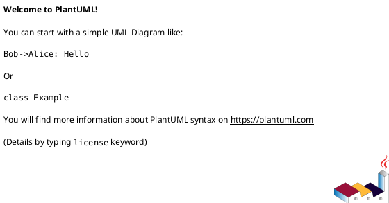
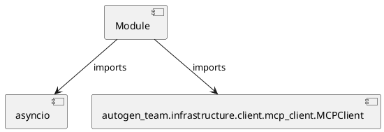

# Module Specification: test_mcp_client_simple

* **Source Reference:** `Scripts/test_mcp_client_simple.py`

## 1. Architectural Role & Responsibilities
**Purpose:**
Provides functionality related to test mcp client simple.

**Architecture Layer:**
- Infrastructure/Other

**Responsibilities:**
- Manage and execute operations for test_mcp_client_simple.

**Main Workflow:**
- Initialize components and process requests for test_mcp_client_simple.

## 2. Dependencies
**Imports:**
- `asyncio`
- `autogen_team.infrastructure.client.mcp_client.MCPClient`

**Exported Classes:**
- None

**Exported Functions:**
- `main`

## 3. Architecture & Execution
### Internal Architecture
Follows standard modular design, encapsulating state and behavior within defined classes and functions.

### Execution Flow
Sequential execution of defined functions and class methods.

### Sequence Explanation
Clients instantiate classes or call functions, which execute business logic and return results.

## 4. UML 2.0 Diagrams
### Class Diagram

### Dependency Graph

## 5. Class & Method Specifications
## 6. Module Functions
### `main()`
Executes the main operation.

**Inputs:**
- None

**Output:**
- Return Type: `None`
