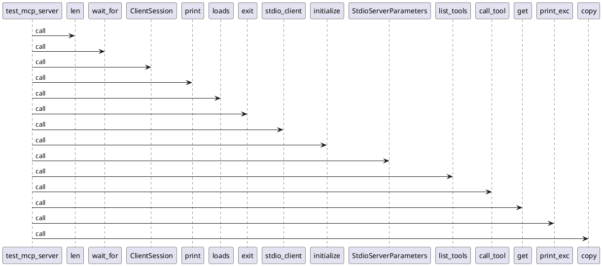
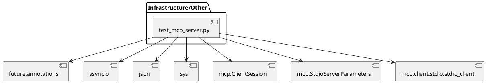
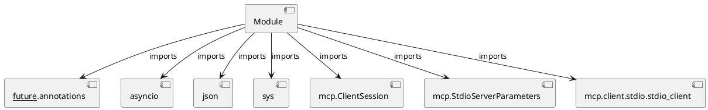
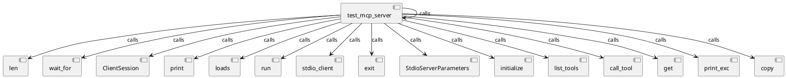

# Module Specification: test_mcp_server

* **Source Reference:** `Scripts/test_mcp_server.py`

## 1. Architectural Role & Responsibilities
**Purpose:**
Provides functionality related to test mcp server.

**Architecture Layer:**
- Infrastructure/Other

**Responsibilities:**
- Manages operations and logic for test mcp server.

**Main Workflow:**
- Executes the primary flow defined by test mcp server functions and classes.

## 2. Dependencies
**Imports:**
- `__future__.annotations`
- `asyncio`
- `json`
- `sys`
- `mcp.ClientSession`
- `mcp.StdioServerParameters`
- `mcp.client.stdio.stdio_client`

**Exported Classes:**
- None

**Exported Functions:**
- `test_mcp_server`

**Exported Interfaces:**
- Not explicitly defined.

**Public API:**
- Not explicitly defined.

## 3. Architecture & Execution
### Internal Architecture
Not explicitly defined.

### Execution Flow
Not explicitly defined.

### Sequence Explanation
Not explicitly defined.

### Examples
Not explicitly defined.

## 4. UML 2.0 Diagrams
### Class Diagram

```plantuml
@startuml
    ' No classes found in module
@enduml
```

### Sequence Diagram

```plantuml
@startuml
    test_mcp_server -> len : call
    test_mcp_server -> wait_for : call
    test_mcp_server -> ClientSession : call
    test_mcp_server -> print : call
    test_mcp_server -> loads : call
    test_mcp_server -> exit : call
    test_mcp_server -> stdio_client : call
    test_mcp_server -> initialize : call
    test_mcp_server -> StdioServerParameters : call
    test_mcp_server -> list_tools : call
    test_mcp_server -> call_tool : call
    test_mcp_server -> get : call
    test_mcp_server -> print_exc : call
    test_mcp_server -> copy : call
@enduml
```

### Component Diagram

```plantuml
@startuml
    package "Infrastructure/Other" {
        [test_mcp_server.py]
    }
    [test_mcp_server.py] --> [__future__.annotations]
    [test_mcp_server.py] --> [asyncio]
    [test_mcp_server.py] --> [json]
    [test_mcp_server.py] --> [sys]
    [test_mcp_server.py] --> [mcp.ClientSession]
    [test_mcp_server.py] --> [mcp.StdioServerParameters]
    [test_mcp_server.py] --> [mcp.client.stdio.stdio_client]
@enduml
```

### Dependency Graph

```plantuml
@startuml
    [Module] --> [__future__.annotations] : imports
    [Module] --> [asyncio] : imports
    [Module] --> [json] : imports
    [Module] --> [sys] : imports
    [Module] --> [mcp.ClientSession] : imports
    [Module] --> [mcp.StdioServerParameters] : imports
    [Module] --> [mcp.client.stdio.stdio_client] : imports
@enduml
```

## 5. Class & Method Specifications
## 6. Module Functions
### `test_mcp_server()`
Connect to MCP server and run tests.

**Inputs:**
- None

**Output:**
- return type: `None`
- semantic meaning: Returns the result of test mcp server.
- possible null values: Yes, if None allows it.
- exceptions: Standard execution exceptions.

**Side Effects:**
- Database updates: Not explicitly defined.
- File operations: Not explicitly defined.
- Network calls: Not explicitly defined.
- Cache: Not explicitly defined.
- State changes: Not explicitly defined.

## 7. Call Graph

```plantuml
@startuml
[test_mcp_server] --> [len] : calls
[test_mcp_server] --> [wait_for] : calls
[test_mcp_server] --> [ClientSession] : calls
[test_mcp_server] --> [print] : calls
[test_mcp_server] --> [loads] : calls
[test_mcp_server] --> [run] : calls
[test_mcp_server] --> [stdio_client] : calls
[test_mcp_server] --> [exit] : calls
[test_mcp_server] --> [StdioServerParameters] : calls
[test_mcp_server] --> [test_mcp_server] : calls
[test_mcp_server] --> [initialize] : calls
[test_mcp_server] --> [list_tools] : calls
[test_mcp_server] --> [call_tool] : calls
[test_mcp_server] --> [get] : calls
[test_mcp_server] --> [print_exc] : calls
[test_mcp_server] --> [copy] : calls
@enduml
```

## 8. Cross References
- **Parent module:** None
- **Child modules:** None
- **Dependencies:** `mcp.StdioServerParameters`, `__future__.annotations`, `mcp.client.stdio.stdio_client`, `mcp.ClientSession`, `sys`, `json`, `asyncio`
- **Used by:** None
- **Calls:** len, wait_for, ClientSession, print, loads, run, stdio_client, exit, StdioServerParameters, test_mcp_server, initialize, list_tools, call_tool, get, print_exc, copy
- **Called from:** None
- **Related classes:** [Classes](../../classes/index.md)
- **Related interfaces:** Not explicitly defined.
- **Related diagrams:** [Diagrams](../../diagrams/index.md)
