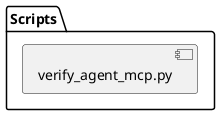
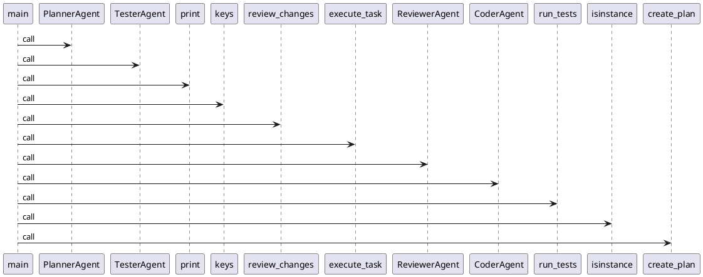
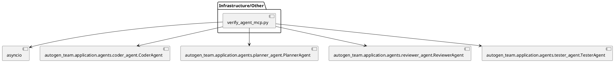
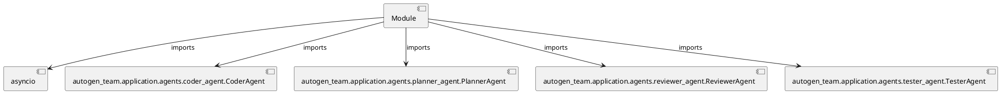
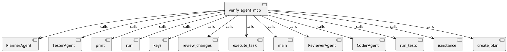

# Module Specification: verify_agent_mcp

* **Source Reference:** `Scripts/verify_agent_mcp.py`

## 1. Architectural Role & Responsibilities
**Purpose:**
Provides functionality related to verify agent mcp.

**Architecture Layer:**
- Infrastructure/Other

**Responsibilities:**
- Not explicitly defined.

**Main Workflow:**
- Not explicitly defined.

## 2. Dependencies
**Imports:**
- `asyncio`
- `autogen_team.application.agents.coder_agent.CoderAgent`
- `autogen_team.application.agents.planner_agent.PlannerAgent`
- `autogen_team.application.agents.reviewer_agent.ReviewerAgent`
- `autogen_team.application.agents.tester_agent.TesterAgent`

**Exported Classes:**
- None

**Exported Functions:**
- `main`

**Exported Interfaces:**
- Not explicitly defined.

**Public API:**
- Not explicitly defined.

## 3. Architecture & Execution
### Internal Architecture
Not explicitly defined.

### Execution Flow
Not explicitly defined.

### Sequence Explanation
Not explicitly defined.

### Examples
Not explicitly defined.

## 4. UML 2.0 Diagrams
### Class Diagram

```plantuml
@startuml
    ' No classes found in module
@enduml
```

### Package Diagram

```plantuml
@startuml
    package "Scripts" {
        [verify_agent_mcp.py]
    }
@enduml
```

### Sequence Diagram

```plantuml
@startuml
    main -> PlannerAgent : call
    main -> TesterAgent : call
    main -> print : call
    main -> keys : call
    main -> review_changes : call
    main -> execute_task : call
    main -> ReviewerAgent : call
    main -> CoderAgent : call
    main -> run_tests : call
    main -> isinstance : call
    main -> create_plan : call
@enduml
```

### Component Diagram

```plantuml
@startuml
    package "Infrastructure/Other" {
        [verify_agent_mcp.py]
    }
    [verify_agent_mcp.py] --> [asyncio]
    [verify_agent_mcp.py] --> [autogen_team.application.agents.coder_agent.CoderAgent]
    [verify_agent_mcp.py] --> [autogen_team.application.agents.planner_agent.PlannerAgent]
    [verify_agent_mcp.py] --> [autogen_team.application.agents.reviewer_agent.ReviewerAgent]
    [verify_agent_mcp.py] --> [autogen_team.application.agents.tester_agent.TesterAgent]
@enduml
```

### Dependency Graph

```plantuml
@startuml
    [Module] --> [asyncio] : imports
    [Module] --> [autogen_team.application.agents.coder_agent.CoderAgent] : imports
    [Module] --> [autogen_team.application.agents.planner_agent.PlannerAgent] : imports
    [Module] --> [autogen_team.application.agents.reviewer_agent.ReviewerAgent] : imports
    [Module] --> [autogen_team.application.agents.tester_agent.TesterAgent] : imports
@enduml
```

## 5. Class & Method Specifications
## 6. Module Functions
### `main() -> None` (Public)
**Description:** Executes the main operation.

**Inputs:**
- None

**Output:**
- return type: `None`
- semantic meaning: Not explicitly defined.
- possible null values: Not explicitly defined.
- exceptions: Not explicitly defined.

**Side Effects:**
- Database updates: Not explicitly defined.
- File operations: Not explicitly defined.
- Network calls: Not explicitly defined.
- Cache: Not explicitly defined.
- State changes: Not explicitly defined.

**Complexity:**
- Time Complexity: Not explicitly defined.
- Space Complexity: Not explicitly defined.

**Example:**
```python
result = main()
```

## 7. Call Graph

```plantuml
@startuml
[verify_agent_mcp] --> [PlannerAgent] : calls
[verify_agent_mcp] --> [TesterAgent] : calls
[verify_agent_mcp] --> [print] : calls
[verify_agent_mcp] --> [run] : calls
[verify_agent_mcp] --> [keys] : calls
[verify_agent_mcp] --> [review_changes] : calls
[verify_agent_mcp] --> [execute_task] : calls
[verify_agent_mcp] --> [main] : calls
[verify_agent_mcp] --> [ReviewerAgent] : calls
[verify_agent_mcp] --> [CoderAgent] : calls
[verify_agent_mcp] --> [run_tests] : calls
[verify_agent_mcp] --> [isinstance] : calls
[verify_agent_mcp] --> [create_plan] : calls
@enduml
```

## 8. Cross References
- **Dependencies:** [Dependencies](../../dependencies/index.md)
- **Used by:** None
- **Calls:** PlannerAgent, TesterAgent, print, run, keys, review_changes, execute_task, main, ReviewerAgent, CoderAgent, run_tests, isinstance, create_plan
- **Called from:** test_mcp_client_simple.md, ../skills/validate/scripts/convert_links.md, ../tests/registry/adapters/test_security_mlflow_adapter.md, ../src/autogen_team/infrastructure/messaging/kafka_app.md, ../src/autogen_team/__main__.md, ../tests/infrastructure/messaging/test_kafka_app.md, ../tests/evaluation/metrics/test_metrics.md, run_hatchet_worker.md, ../skills/validate/scripts/okf_validate.md, send_kafka_test.md, ../tests/test_scripts.md, trigger_mission.md, ../tests/repro_kafka_log.md
- **Related classes:** [Classes](../../classes/index.md)
- **Related diagrams:** [Diagrams](../../diagrams/index.md)
