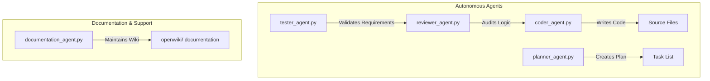

# Agent Implementation Details
The `src/autogen_team/application/agents/` directory contains the core logic for various specialized agents. Each agent is designed to perform a specific role within the multi-agent system.

## Agent Roles & Structure
The following diagram represents the functional roles of the available agents:

## Agent Specifications:

### 1. Planner Agent (`planner_agent.py`)
Responsible for breaking down high-level user requirements into actionable sub-tasks and creating a project roadmap.

### 2. Coder Agent (`coder_agent.py`)
The primary implementation agent. It consumes the plans generated by the `Planner` to write, modify, or refactor code in the codebase.

### 3. Reviewer Agent (`reviewer_agent.py`)
Acts as a quality gate. It analyzes the output of the `Coder` agent to ensure adherence to coding standards, security requirements, and functional accuracy.

### 4. Tester Agent (`tester_agent.py`)
Focuses on verification. It generates test cases and executes them against the code produced by the `Coder`.

### 5. Documentation Agent (`documentation_agent.py`)
Specifically tasked with maintaining the internal knowledge base (OpenWiki). It updates documentation based on changes detected in the codebase or during plan execution.

*Refer to:*
- *Source Files: `src/autogen_team/application/agents/*.py`*
