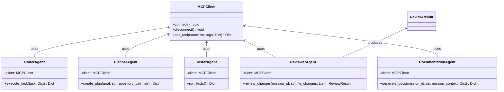

# Module Specification: Application Agents

* **Source Reference:** `src/autogen_team/application/agents/` (5 agent files)
* **Upstream Dependencies:** [[Modules/Infrastructure/Services]] (`MCPClient`)
* **Downstream Consumers:** [[Modules/Application/Workflows]] (`AutonomousMissionWorkflow`)

## 1. Architectural Role & Responsibilities

The agents sub-package implements the autonomous agent roles in the CA/CD factory. Each agent follows a consistent pattern: instantiate an `MCPClient`, connect, call a specific MCP tool, and disconnect. Agents are stateless and designed for ephemeral use within Hatchet workflow steps.

## 2. UML 2.0 Class Diagram

## 3. Agent Specifications

### `CoderAgent` (`src/autogen_team/application/agents/coder_agent.py:L6-L24`)

Agent responsible for executing coding tasks using the MCP `execute_code` tool.

* **`execute_task(self, task: Dict[str, Any]) -> Dict[str, Any]`** (L15-L23)
  - **Purpose:** Execute a coding task by calling the `execute_code` MCP tool.
  - **Inputs:** `task` — Dict with keys: `id`, `description`, `relevant_files`, `constraints`.
  - **MCP Tool:** `execute_code`

### `PlannerAgent` (`src/autogen_team/application/agents/planner_agent.py:L6-L27`)

Agent responsible for decomposing high-level goals into detailed plans.

* **`create_plan(self, goal: str, repository_path: str) -> Dict[str, Any]`** (L15-L26)
  - **Purpose:** Create a task DAG from a high-level goal.
  - **Inputs:** `goal` (str), `repository_path` (str).
  - **MCP Tool:** `plan_mission`

### `ReviewerAgent` (`src/autogen_team/application/agents/reviewer_agent.py:L7-L45`)

Agent responsible for reviewing code changes for security vulnerabilities.

* **`review_changes(self, mission_id: str, file_changes: List[str]) -> ReviewResult`** (L16-L44)
  - **Purpose:** Review aggregated code diffs for security issues.
  - **Inputs:** `mission_id` (str), `file_changes` (List[str]).
  - **MCP Tool:** `security_review`
  - **Output:** `ReviewResult` with `approved`, `comments`, `suggested_changes`.

### `TesterAgent` (`src/autogen_team/application/agents/tester_agent.py`)

Agent responsible for running tests in isolated sandboxes.

* **`run_tests(self) -> Dict[str, Any]`**
  - **MCP Tool:** `run_tests`

### `DocumentationAgent` (`src/autogen_team/application/agents/documentation_agent.py`)

Agent responsible for generating mission documentation and diagrams.

* **`generate_docs(self, mission_id: str, mission_context: Dict) -> Dict[str, Any]`**
  - **MCP Tool:** `generate_mission_docs`
