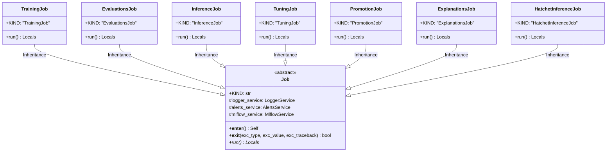

# Module Specification: Application Jobs

* **Source Reference:** `src/autogen_team/application/jobs/` (8 files)
* **Upstream Dependencies:** [[Modules/Infrastructure/Services]] (LoggerService, AlertsService, MlflowService)

## 1. Architectural Role & Responsibilities

The jobs sub-package provides legacy batch ML pipeline orchestration. Each job type extends the abstract `Job` base class and executes within a context-manager that automatically manages service lifecycles (logging, alerts, MLflow tracking).

## 2. UML 2.0 Class Diagram



## 3. Base Job Specification

### `Job` (`src/autogen_team/application/jobs/base.py:L21-L86`)

Abstract base class for all batch jobs. Provides automatic service lifecycle management via Python context manager.

#### Methods

* **`__enter__(self) -> Self`** (L39-L52)
  - Starts `LoggerService`, `AlertsService`, `MlflowService` in sequence.
* **`__exit__(self, ...) -> Literal[False]`** (L54-L77)
  - Stops services in reverse order. Always re-raises exceptions.
* **`run(self) -> Locals`** (L79-L85)
  - Abstract method implementing the job's domain logic.

## 4. Job Type Union

**Source:** `src/autogen_team/application/jobs/__init__.py:L15-L23`

```python
JobKind = (
    TuningJob | TrainingJob | PromotionJob | InferenceJob
    | EvaluationsJob | ExplanationsJob | HatchetInferenceJob
)
```

Used as the discriminated union type in `MainSettings.job` for CLI-driven configuration.
