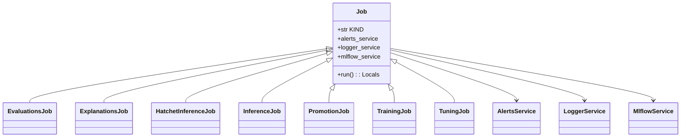

# Module Specification: Base

* **Source Reference:** `src/autogen_team/application/jobs/base.py`

## UML Diagrams

```mermaid
classDiagram
    class Job {
        +str KIND
        +alerts_service
        +logger_service
        +mlflow_service
        +run(): Locals
    }
    Job <|-- EvaluationsJob
    Job <|-- ExplanationsJob
    Job <|-- HatchetInferenceJob
    Job <|-- InferenceJob
    Job <|-- PromotionJob
    Job <|-- TrainingJob
    Job <|-- TuningJob
    Job --> AlertsService
    Job --> LoggerService
    Job --> MlflowService
```
