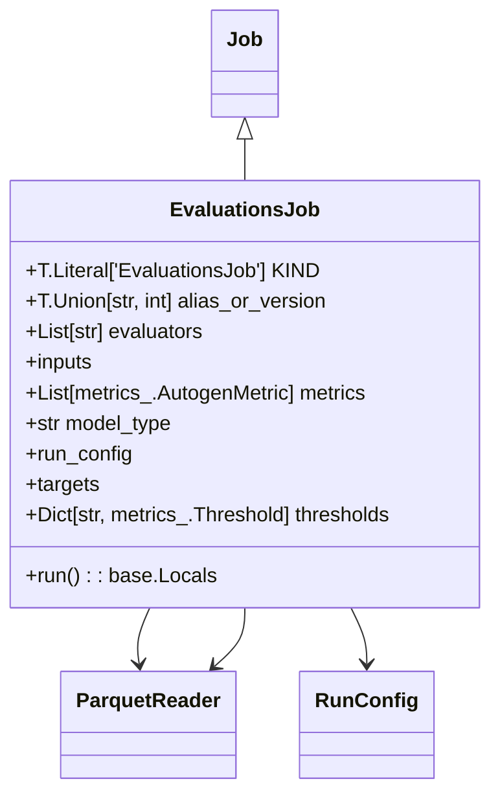

# Module Specification: Evaluations

* **Source Reference:** `src/autogen_team/application/jobs/evaluations.py`

## UML Diagrams

```mermaid
classDiagram
    class EvaluationsJob {
        +T.Literal['EvaluationsJob'] KIND
        +T.Union[str, int] alias_or_version
        +List[str] evaluators
        +inputs
        +List[metrics_.AutogenMetric] metrics
        +str model_type
        +run_config
        +targets
        +Dict[str, metrics_.Threshold] thresholds
        +run(): base.Locals
    }
    Job <|-- EvaluationsJob
    EvaluationsJob --> ParquetReader
    EvaluationsJob --> ParquetReader
    EvaluationsJob --> RunConfig
```
