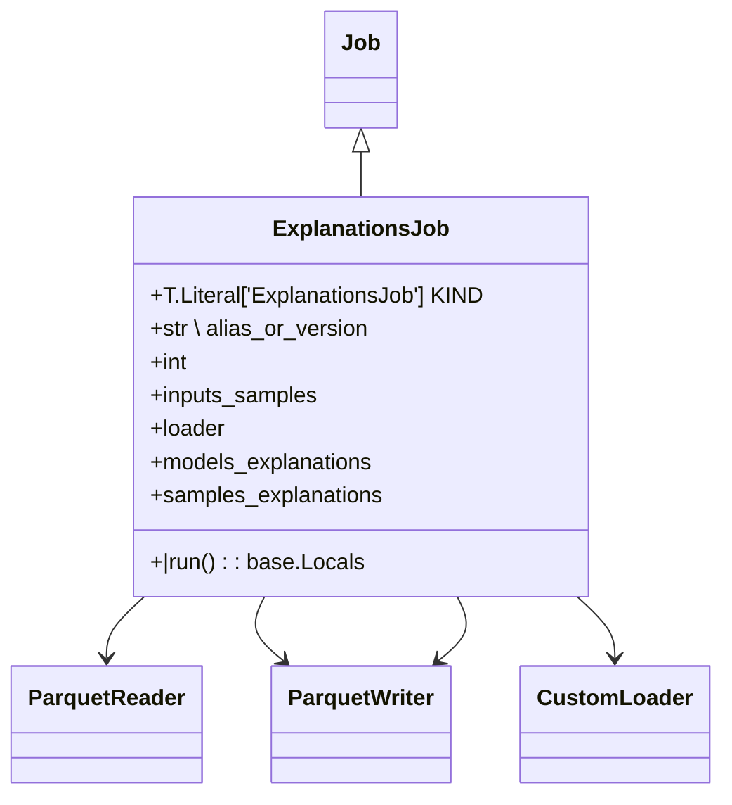

# Module Specification: Explanations

* **Source Reference:** `src/autogen_team/application/jobs/explanations.py`

## UML Diagrams

```mermaid
classDiagram
    class ExplanationsJob {
        +T.Literal['ExplanationsJob'] KIND
        +str \ alias_or_version
        +int
        +inputs_samples
        +loader
        +models_explanations
        +samples_explanations
        +|run(): base.Locals
    }
    Job <|-- ExplanationsJob
    ExplanationsJob --> ParquetReader
    ExplanationsJob --> ParquetWriter
    ExplanationsJob --> ParquetWriter
    ExplanationsJob --> CustomLoader
```
