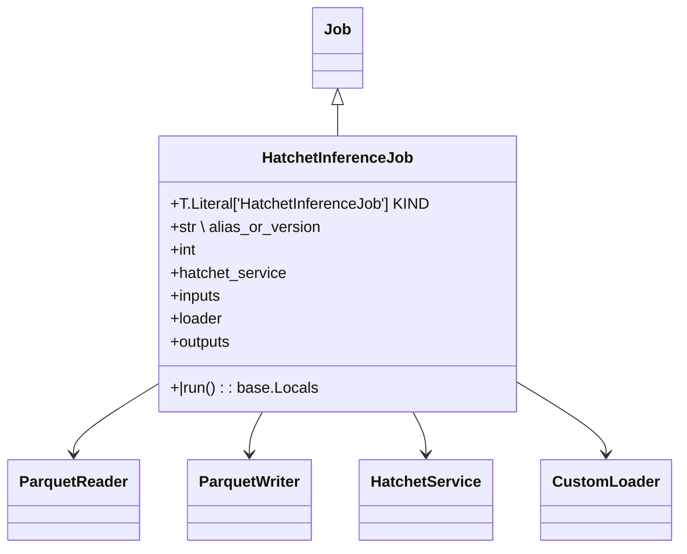

# Module Specification: Hatchet Inference

* **Source Reference:** `src/autogen_team/application/jobs/hatchet_inference.py`

## UML Diagrams

```mermaid
classDiagram
    class HatchetInferenceJob {
        +T.Literal['HatchetInferenceJob'] KIND
        +str \ alias_or_version
        +int
        +hatchet_service
        +inputs
        +loader
        +outputs
        +|run(): base.Locals
    }
    Job <|-- HatchetInferenceJob
    HatchetInferenceJob --> ParquetReader
    HatchetInferenceJob --> ParquetWriter
    HatchetInferenceJob --> HatchetService
    HatchetInferenceJob --> CustomLoader
```
