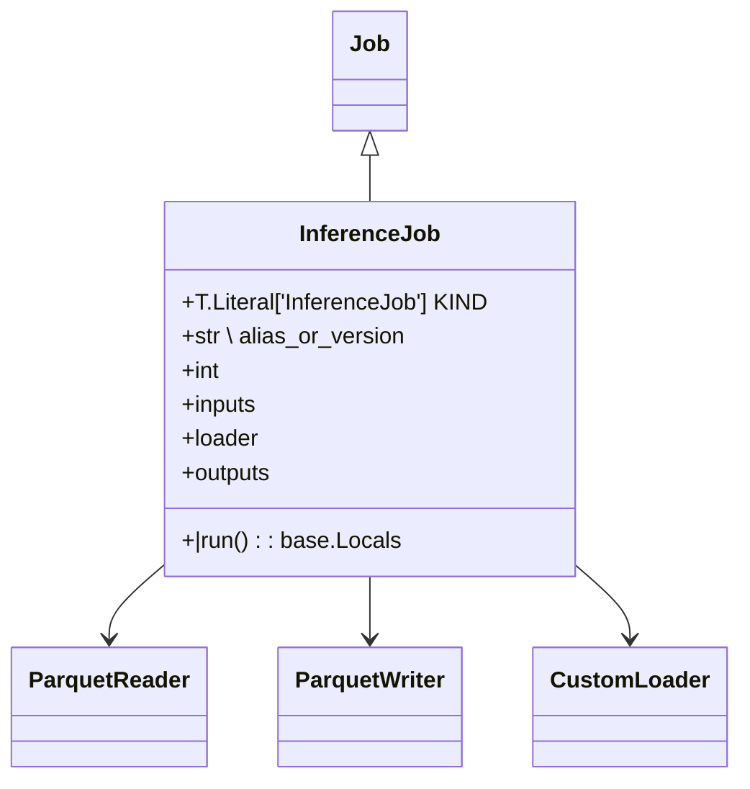

# Module Specification: Inference

* **Source Reference:** `src/autogen_team/application/jobs/inference.py`

## UML Diagrams

```mermaid
classDiagram
    class InferenceJob {
        +T.Literal['InferenceJob'] KIND
        +str \ alias_or_version
        +int
        +inputs
        +loader
        +outputs
        +|run(): base.Locals
    }
    Job <|-- InferenceJob
    InferenceJob --> ParquetReader
    InferenceJob --> ParquetWriter
    InferenceJob --> CustomLoader
```
