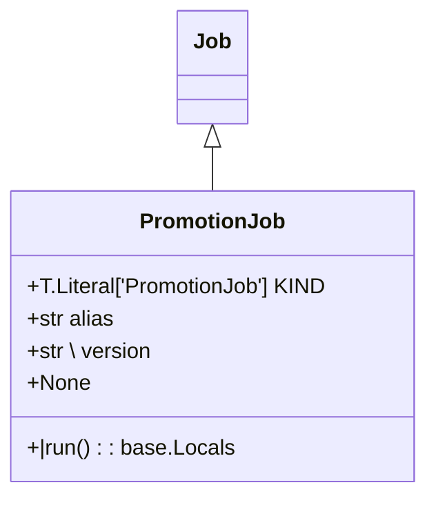

# Module Specification: Promotion

* **Source Reference:** `src/autogen_team/application/jobs/promotion.py`

## UML Diagrams

```mermaid
classDiagram
    class PromotionJob {
        +T.Literal['PromotionJob'] KIND
        +str alias
        +str \ version
        +None
        +|run(): base.Locals
    }
    Job <|-- PromotionJob
```
