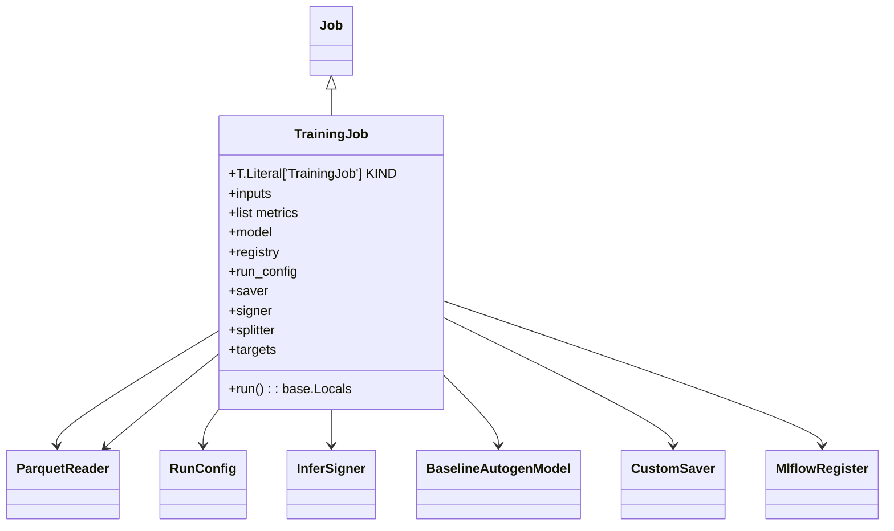

# Module Specification: Training

* **Source Reference:** `src/autogen_team/application/jobs/training.py`

## UML Diagrams

```mermaid
classDiagram
    class TrainingJob {
        +T.Literal['TrainingJob'] KIND
        +inputs
        +list metrics
        +model
        +registry
        +run_config
        +saver
        +signer
        +splitter
        +targets
        +run(): base.Locals
    }
    Job <|-- TrainingJob
    TrainingJob --> ParquetReader
    TrainingJob --> ParquetReader
    TrainingJob --> RunConfig
    TrainingJob --> InferSigner
    TrainingJob --> BaselineAutogenModel
    TrainingJob --> CustomSaver
    TrainingJob --> MlflowRegister
```
