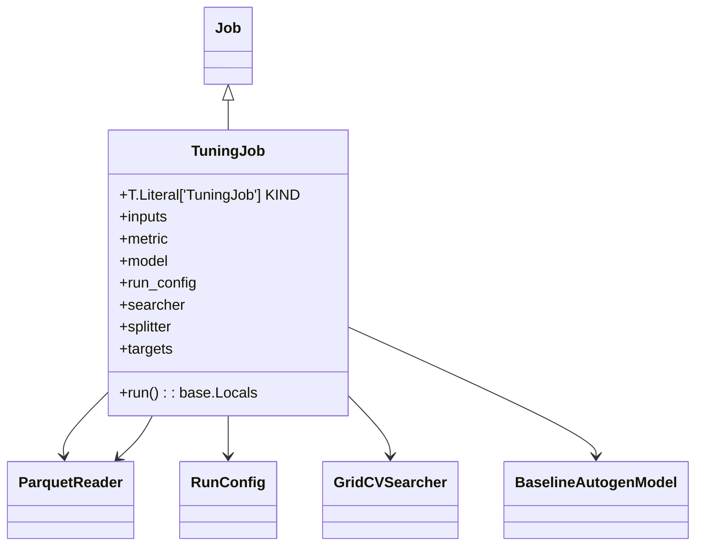

# Module Specification: Tuning

* **Source Reference:** `src/autogen_team/application/jobs/tuning.py`

## UML Diagrams

```mermaid
classDiagram
    class TuningJob {
        +T.Literal['TuningJob'] KIND
        +inputs
        +metric
        +model
        +run_config
        +searcher
        +splitter
        +targets
        +run(): base.Locals
    }
    Job <|-- TuningJob
    TuningJob --> ParquetReader
    TuningJob --> ParquetReader
    TuningJob --> RunConfig
    TuningJob --> GridCVSearcher
    TuningJob --> BaselineAutogenModel
```
