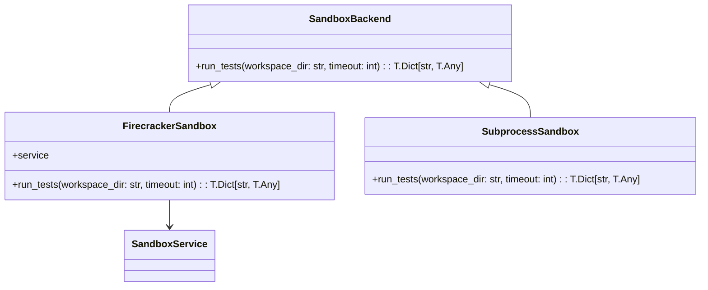

# Module Specification: Run Tests

* **Source Reference:** `src/autogen_team/application/mcp/tools/run_tests.py`

## UML Diagrams

```mermaid
classDiagram
    class FirecrackerSandbox {
        +service
        +run_tests(workspace_dir: str, timeout: int): T.Dict[str, T.Any]
    }
    class SandboxBackend {
        +run_tests(workspace_dir: str, timeout: int): T.Dict[str, T.Any]
    }
    class SubprocessSandbox {
        +run_tests(workspace_dir: str, timeout: int): T.Dict[str, T.Any]
    }
    SandboxBackend <|-- FirecrackerSandbox
    SandboxBackend <|-- SubprocessSandbox
    FirecrackerSandbox --> SandboxService
```
