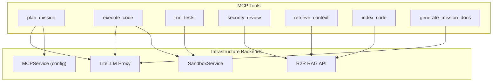

# Module Specification: MCP Tools

* **Source Reference:** `src/autogen_team/application/mcp/tools/` (7 tool modules)
* **Upstream Dependencies:** [[Modules/Infrastructure/Services]] (`MCPService`, `SandboxService`)

## 1. Architectural Role & Responsibilities

The MCP tools sub-package implements the Model Context Protocol server's tool functions. Each tool is an independent async function that agents invoke via the `MCPClient`. Tools delegate to infrastructure services (LiteLLM for LLM completions, R2R for RAG queries, SandboxService for isolated execution).

## 2. Tool Dependency Diagram

## 3. Tool Specifications

### `plan_mission` (`application/mcp/tools/plan_mission.py:L13-L58`)

Decomposes a high-level goal into a task DAG using LiteLLM.

| Parameter | Type | Description |
| :--- | :--- | :--- |
| `goal` | `str` | High-level goal string |
| **Returns** | `Dict[str, Any]` | `{goal, parallel_tasks: [...], error?}` |

**Flow:** Validates input → loads system prompt from `MCPService` → calls `litellm.acompletion()` with JSON response format → parses and validates result.

### `execute_code` (`application/mcp/tools/execute_code.py`)

Generates and injects code changes within a sandbox environment.

### `run_tests` (`application/mcp/tools/run_tests.py`)

Runs pytest in an isolated sandbox. Uses `SandboxService` for E2B/Firecracker MicroVM execution. Validates workspace paths via `safe_join()`.

### `security_review` (`application/mcp/tools/security_review.py`)

Analyzes code diffs against OWASP patterns and R2R RAG security knowledge. Two-phase analysis:
1. `_scan_owasp_patterns(diff)` — Regex-based vulnerability detection
2. `_query_r2r_security(diff)` — Semantic security knowledge retrieval

### `retrieve_context` (`application/mcp/tools/retrieve_context.py`)

Queries R2R RAG system for relevant codebase patterns via semantic search.

### `index_code` (`application/mcp/tools/index_code.py`)

Indexes a code file into the R2R knowledge graph for future retrieval.

### `generate_mission_docs` (`application/mcp/tools/generate_mission_docs.py`)

Generates Mermaid diagrams and documentation from mission results using LiteLLM.
