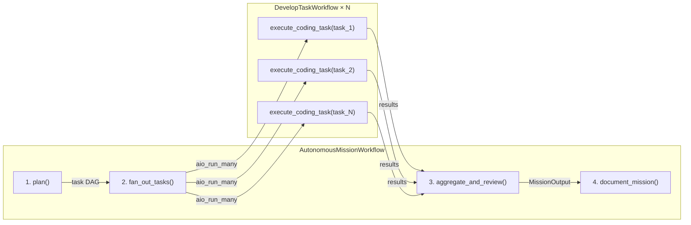
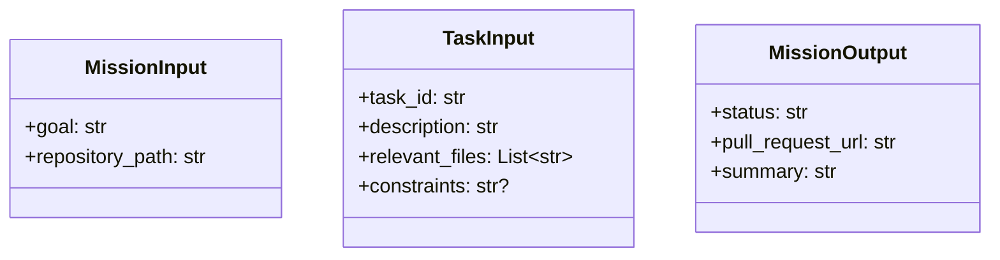

# Module Specification: Application Workflows

* **Source Reference:** `src/autogen_team/application/workflows/autonomous_mission.py` (Lines: L1-L214)
* **Upstream Dependencies:** [[Modules/Application/Agents]], [[Modules/Infrastructure/Services]] (`HatchetService`)

## 1. Architectural Role & Responsibilities

This module defines the flagship **Autonomous Mission Workflow** using Hatchet's Workflow DSL. It orchestrates the complete mission lifecycle from goal decomposition through parallel code execution, security review, and documentation generation — all with durable execution state.

## 2. Workflow Architecture

## 3. Workflow Steps

### Step 1: `plan()` (L92-L103)
- **Timeout:** 5 minutes
- **Agent:** `PlannerAgent`
- **Action:** Decomposes goal into a task DAG via `plan_mission` MCP tool
- **Output:** `{plan: mission_plan}`

### Step 2: `fan_out_tasks()` (L105-L135)
- **Timeout:** 30 minutes
- **Parent:** `plan`
- **Action:** Spawns parallel `DevelopTaskWorkflow` instances via `aio_run_many`
- **Concurrency:** True parallel fan-out across Hatchet worker pool
- **Output:** `{results: [...]}`

### Step 3: `aggregate_and_review()` (L138-L174)
- **Timeout:** 15 minutes
- **Parent:** `fan_out_tasks`
- **Agents:** `TesterAgent` (run tests), `ReviewerAgent` (security review)
- **Output:** `MissionOutput(status, pull_request_url, summary)`

### Step 4: `document_mission()` (L177-L214)
- **Timeout:** 10 minutes
- **Parent:** `aggregate_and_review`
- **Agent:** `DocumentationAgent`
- **Action:** Generate Mermaid diagrams and documentation
- **Output:** `MissionOutput` with updated summary

## 4. Data Models

