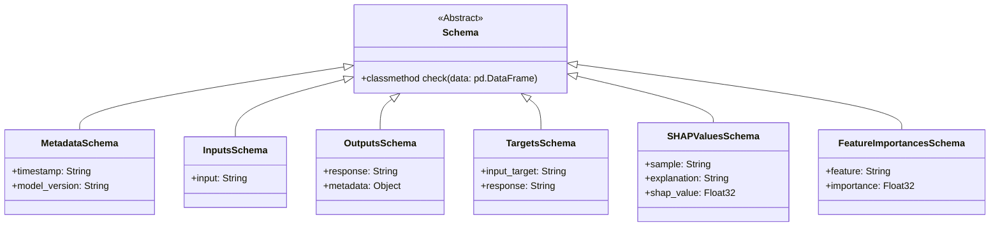

# Core Schemas
The core schema module defines the fundamental data structures used throughout the application. It utilizes `pandera` to ensure strict typing and validation for DataFrames, which are central to the machine learning pipeline.

## Schema Overview
The following mermaid diagram shows the inheritance hierarchy of the schemas:

## Detailed Explanations
- **`Schema`**: The base class for all data validations. It uses `pandera.DataFrameModel` to enforce consistency during the ingestion of raw model outputs.
- **`Inputs` / `Targets`**: These are specific types (wrapped in `pandera.DataFrame`) that represent the training data and desired results respectively.
- **`SHAPValuesSchema` & `FeatureImportancesSchema`**: These schemas are specifically designed to hold explainability data, ensuring that model "interpretability" results are structured correctly for downstream analysis.

*Refer to: `src/autogen_team/core/schemas.py`*
