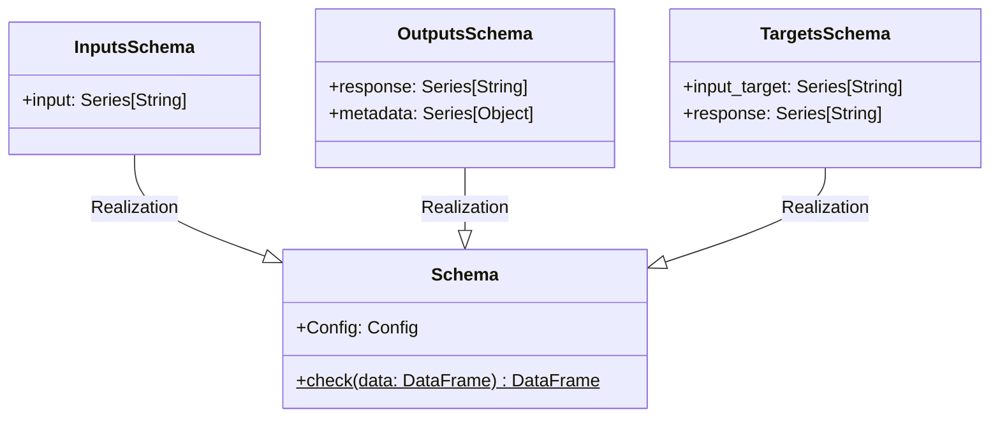

# Module Specification: `autogen_team.core`

* **Source File Reference:** `src/autogen_team/core/schemas.py` (Lines: L1-L114)
* **Upstream Dependencies:** `pandas`, `pandera`
* **Downstream Consumers:** [[Modules/Application|autogen_team.application]]

---

## 1. Architectural Role & Responsibilities

The `autogen_team.core` module defines the data schema foundation for the application. Using Pandera DataFrame models, it validates inputs, outputs, targets, SHAP values, and feature importances.

---

## 2. UML 2.0 Class Diagram

---

## 3. Schema Class Contracts

### `Schema.check(data: pd.DataFrame)`
- **Source Line Citation:** `src/autogen_team/core/schemas.py:L36-L46`
- **Behavior**: Validates input pandas DataFrame against the declared schema model and returns typed `papd.DataFrame[TSchema]`.
