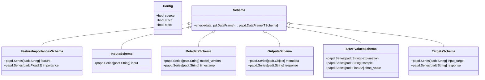

# Module Specification: Core Schemas

* **Source Reference:** `src/autogen_team/core/schemas.py` (Lines: L1-L114)
* **Downstream Consumers:** [[Modules/Models/Entities]], [[Modules/DataAccess/Datasets]], [[Modules/Evaluation/Metrics]], [[Modules/Registry/MlflowAdapter]], [[Modules/Infrastructure/Utils]]

## 1. Architectural Role & Responsibilities

The schemas module defines the shared data contracts for the entire system using **Pandera** `DataFrameModel` classes. All data flowing between layers (training inputs, prediction outputs, SHAP values, feature importances) is validated against these schemas, ensuring type safety and data integrity.

## 2. UML 2.0 Class Diagram

## 3. Class & Method Specifications

### `Schema` (`src/autogen_team/core/schemas.py:L18-L46`)

Base class for all dataframe schemas. Extends Pandera's `DataFrameModel` with strict validation and type coercion.

#### Methods

* **`check(cls: Type[TSchema], data: pd.DataFrame) -> papd.DataFrame[TSchema]`** (L36-L46)
  - **Purpose:** Validate a DataFrame against the schema, returning a typed DataFrame.
  - **Inputs:** `data` (`pd.DataFrame`): raw dataframe to validate.
  - **Outputs:** `papd.DataFrame[TSchema]`: validated, typed dataframe.

## 4. Type Aliases

| Alias | Definition | Line |
| :--- | :--- | :--- |
| `Inputs` | `papd.DataFrame[InputsSchema]` | L94 |
| `Targets` | `papd.DataFrame[TargetsSchema]` | L95 |
| `Outputs` | `papd.DataFrame[OutputsSchema]` | L96 |
| `SHAPValues` | `papd.DataFrame[SHAPValuesSchema]` | L97 |
| `FeatureImportances` | `papd.DataFrame[FeatureImportancesSchema]` | L98 |

