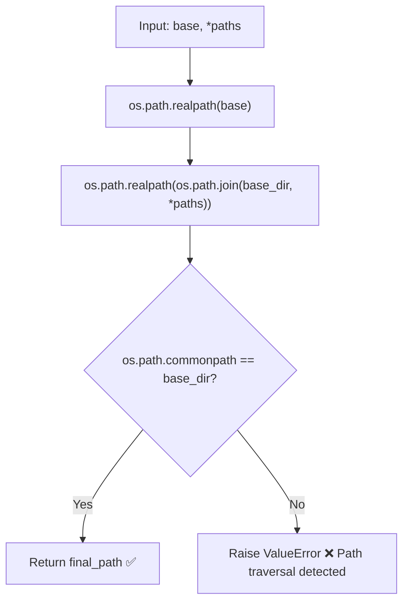

# Module Specification: Core Security

* **Source Reference:** `src/autogen_team/core/security.py` (Lines: L1-L27)
* **Downstream Consumers:** [[Modules/Infrastructure/Services]] (`SandboxService.upload_artifact`), MCP `run_tests` tool

## 1. Architectural Role & Responsibilities

The security module provides critical path traversal prevention for the shared kernel. The `safe_join()` function is used wherever user-controlled or sandbox-controlled file paths interact with the host filesystem.

## 2. Function Specification

### `safe_join(base: str, *paths: str) -> str` (`src/autogen_team/core/security.py:L6-L27`)

Safely join paths, ensuring the result is within the base directory. Resolves symlinks via `os.path.realpath()` before validation.

- **Inputs:**
  - `base` (`str`): The base directory.
  - `*paths` (`str`): Paths to join.
- **Outputs:** `str`: The joined path.
- **Raises:** `ValueError`: If the resolved path is outside the base directory.

### Security Algorithm



```mermaid
classDiagram
```
