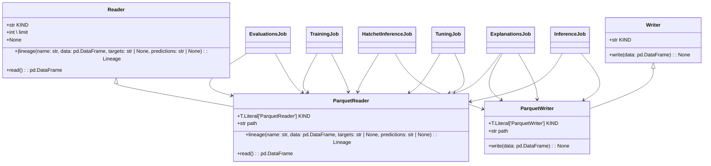

# Module Specification: Datasets

* **Source Reference:** `src/autogen_team/data_access/adapters/datasets.py`

## Overview
This module provides data access functionality for Datasets.

## UML Diagrams

