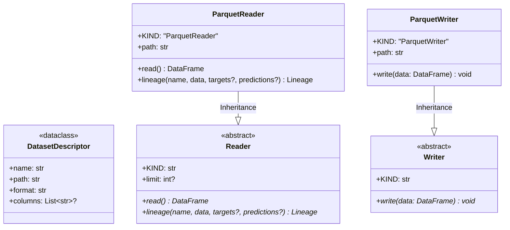

# Module Specification: Data Access Datasets

* **Source Reference:** `src/autogen_team/data_access/` (3 files)
* **Bounded Context:** Data Access

## 1. UML 2.0 Class Diagram



## 2. Entities (`entities.py:L1-L15`)

### `DatasetDescriptor`

Dataclass describing a dataset source:

| Field | Type | Purpose |
| :--- | :--- | :--- |
| `name` | `str` | Dataset identifier |
| `path` | `str` | File or URI path |
| `format` | `str` | Format: `"parquet"`, `"json"`, `"csv"` |
| `columns` | `Optional[list[str]]` | Column filter |

## 3. Adapters (`adapters/datasets.py:L1-L131`)

### Reader Hierarchy

* **`Reader`** (abstract, L19-L60): Base class with optional `limit` parameter and two abstract methods: `read()` and `lineage()`.
* **`ParquetReader`** (L62-L89): Reads parquet files via `pd.read_parquet()`. Applies limit via `head()`. Generates lineage via `mlflow.data.pandas_dataset.from_pandas()`.

### Writer Hierarchy

* **`Writer`** (abstract, L97-L112): Base class with abstract `write(data)` method.
* **`ParquetWriter`** (L115-L127): Writes DataFrames to parquet files via `pd.DataFrame.to_parquet()`.

### Type Aliases

```python
ReaderKind = ParquetReader    # Union type for discriminated config
WriterKind = ParquetWriter    # Union type for discriminated config
Lineage = lineage.PandasDataset  # MLflow data lineage type
```
