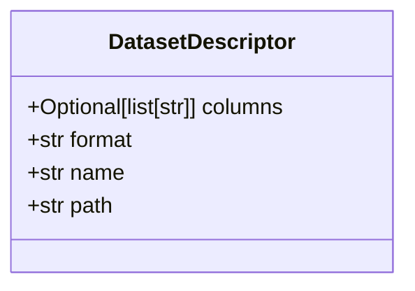

# Module Specification: Entities

* **Source Reference:** `src/autogen_team/data_access/entities.py`

## Overview
This module provides data access functionality for Entities.

## UML Diagrams

```mermaid
classDiagram
    class DatasetDescriptor {
        +Optional[list[str]] columns
        +str format
        +str name
        +str path
    }
```
