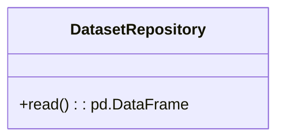

# Module Specification: Repositories

* **Source Reference:** `src/autogen_team/data_access/repositories.py`

## Overview
This module provides data access functionality for Repositories.

## UML Diagrams

