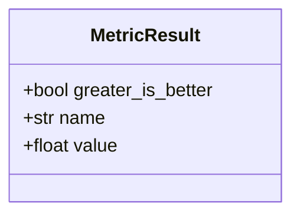

# Module Specification: Entities

* **Source Reference:** `src/autogen_team/evaluation/entities.py`

## UML Diagrams

```mermaid
classDiagram
    class MetricResult {
        +bool greater_is_better
        +str name
        +float value
    }
```
