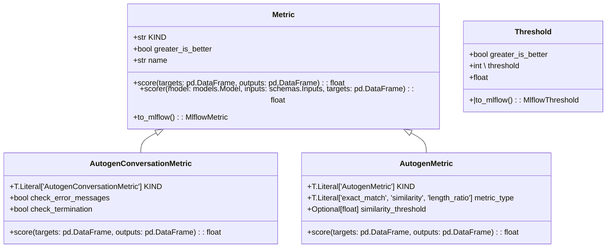

# Module Specification: Metrics

* **Source Reference:** `src/autogen_team/evaluation/metrics/metrics.py`

## UML Diagrams

```mermaid
classDiagram
    class AutogenConversationMetric {
        +T.Literal['AutogenConversationMetric'] KIND
        +bool check_error_messages
        +bool check_termination
        +score(targets: pd.DataFrame, outputs: pd.DataFrame): float
    }
    class AutogenMetric {
        +T.Literal['AutogenMetric'] KIND
        +T.Literal['exact_match', 'similarity', 'length_ratio'] metric_type
        +Optional[float] similarity_threshold
        +score(targets: pd.DataFrame, outputs: pd.DataFrame): float
    }
    class Metric {
        +str KIND
        +bool greater_is_better
        +str name
        +score(targets: pd.DataFrame, outputs: pd.DataFrame): float
        +scorer(model: models.Model, inputs: schemas.Inputs, targets: pd.DataFrame): float
        +to_mlflow(): MlflowMetric
    }
    class Threshold {
        +bool greater_is_better
        +int \ threshold
        +float
        +|to_mlflow(): MlflowThreshold
    }
    Metric <|-- AutogenConversationMetric
    Metric <|-- AutogenMetric
```
