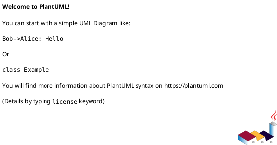
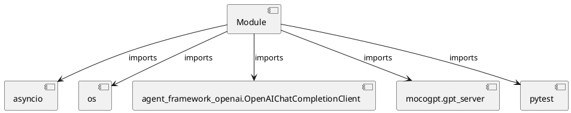

# Module Specification: fix_test

* **Source Reference:** `fix_test.py`

## 1. Architectural Role & Responsibilities
**Purpose:**
Provides functionality related to fix test.

**Architecture Layer:**
- Infrastructure/Other

**Responsibilities:**
- Not explicitly defined.

**Main Workflow:**
- Not explicitly defined.

## 2. Dependencies
**Imports:**
- `asyncio`
- `os`
- `agent_framework_openai.OpenAIChatCompletionClient`
- `mocogpt.gpt_server`
- `pytest`

**Exported Classes:**
- None

**Exported Functions:**
- `test_it`

## 3. Architecture & Execution
### Internal Architecture
Not explicitly defined.

### Execution Flow
Not explicitly defined.

### Sequence Explanation
Not explicitly defined.

## 4. UML 2.0 Diagrams
### Class Diagram

### Dependency Graph

## 5. Class & Method Specifications
## 6. Module Functions
### `test_it()`
No description provided.

**Inputs:**
- None

**Output:**
- Return Type: `Any`
