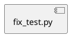
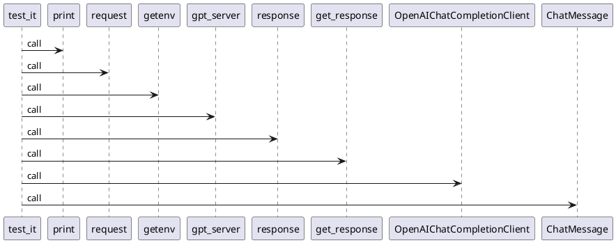
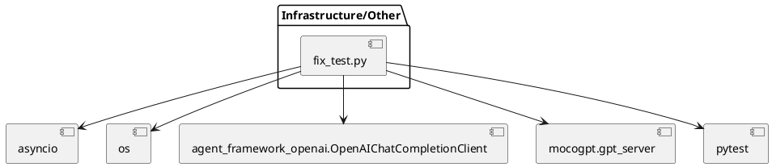
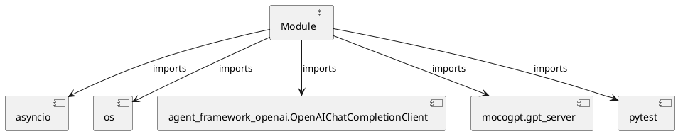
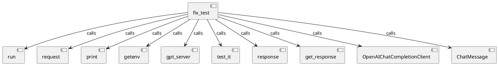

# Module Specification: fix_test

* **Source Reference:** `fix_test.py`

## 1. Architectural Role & Responsibilities
**Purpose:**
Provides functionality related to fix test.

**Architecture Layer:**
- Infrastructure/Other

**Responsibilities:**
- Not explicitly defined.

**Main Workflow:**
- Not explicitly defined.

## 2. Dependencies
**Imports:**
- `asyncio`
- `os`
- `agent_framework_openai.OpenAIChatCompletionClient`
- `mocogpt.gpt_server`
- `pytest`

**Exported Classes:**
- None

**Exported Functions:**
- `test_it`

**Exported Interfaces:**
- Not explicitly defined.

**Public API:**
- Not explicitly defined.

## 3. Architecture & Execution
### Internal Architecture
Not explicitly defined.

### Execution Flow
Not explicitly defined.

### Sequence Explanation
Not explicitly defined.

### Examples
Not explicitly defined.

## 4. UML 2.0 Diagrams
### Class Diagram

```plantuml
@startuml
    ' No classes found in module
@enduml
```

### Package Diagram

```plantuml
@startuml
    [fix_test.py]
@enduml
```

### Sequence Diagram

```plantuml
@startuml
    test_it -> print : call
    test_it -> request : call
    test_it -> getenv : call
    test_it -> gpt_server : call
    test_it -> response : call
    test_it -> get_response : call
    test_it -> OpenAIChatCompletionClient : call
    test_it -> ChatMessage : call
@enduml
```

### Component Diagram

```plantuml
@startuml
    package "Infrastructure/Other" {
        [fix_test.py]
    }
    [fix_test.py] --> [asyncio]
    [fix_test.py] --> [os]
    [fix_test.py] --> [agent_framework_openai.OpenAIChatCompletionClient]
    [fix_test.py] --> [mocogpt.gpt_server]
    [fix_test.py] --> [pytest]
@enduml
```

### Dependency Graph

```plantuml
@startuml
    [Module] --> [asyncio] : imports
    [Module] --> [os] : imports
    [Module] --> [agent_framework_openai.OpenAIChatCompletionClient] : imports
    [Module] --> [mocogpt.gpt_server] : imports
    [Module] --> [pytest] : imports
@enduml
```

## 5. Class & Method Specifications
## 6. Module Functions
### `test_it() -> Any` (Public)
**Description:** Executes the test it operation.

**Inputs:**
- None

**Output:**
- return type: `Any`
- semantic meaning: Not explicitly defined.
- possible null values: Not explicitly defined.
- exceptions: Not explicitly defined.

**Side Effects:**
- Database updates: Not explicitly defined.
- File operations: Not explicitly defined.
- Network calls: Not explicitly defined.
- Cache: Not explicitly defined.
- State changes: Not explicitly defined.

**Complexity:**
- Time Complexity: Not explicitly defined.
- Space Complexity: Not explicitly defined.

**Example:**
```python
result = test_it()
```

## 7. Call Graph

```plantuml
@startuml
[fix_test] --> [run] : calls
[fix_test] --> [request] : calls
[fix_test] --> [print] : calls
[fix_test] --> [getenv] : calls
[fix_test] --> [gpt_server] : calls
[fix_test] --> [test_it] : calls
[fix_test] --> [response] : calls
[fix_test] --> [get_response] : calls
[fix_test] --> [OpenAIChatCompletionClient] : calls
[fix_test] --> [ChatMessage] : calls
@enduml
```

## 8. Cross References
- **Dependencies:** [Dependencies](../dependencies/index.md)
- **Used by:** None
- **Calls:** run, request, print, getenv, gpt_server, test_it, response, get_response, OpenAIChatCompletionClient, ChatMessage
- **Called from:** None
- **Related classes:** [Classes](../classes/index.md)
- **Related diagrams:** [Diagrams](../diagrams/index.md)
